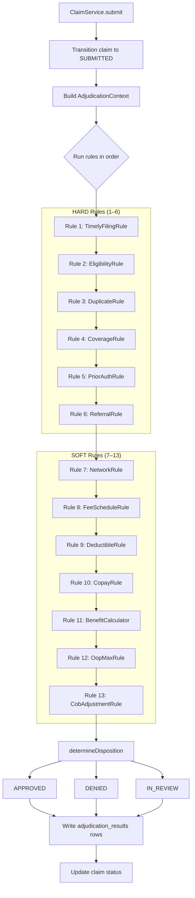
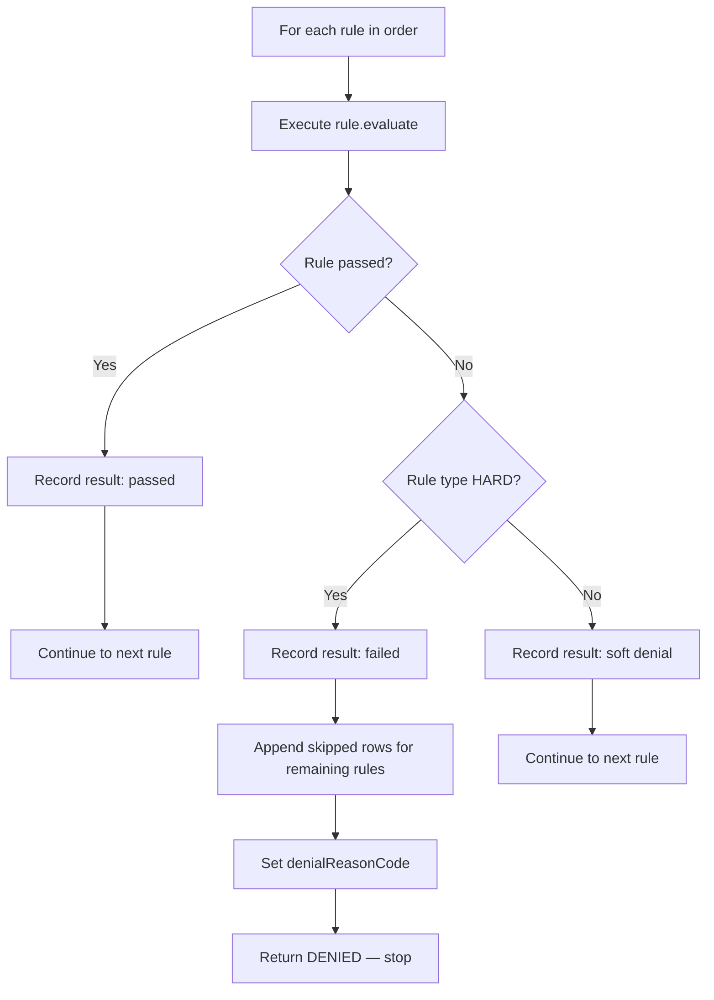
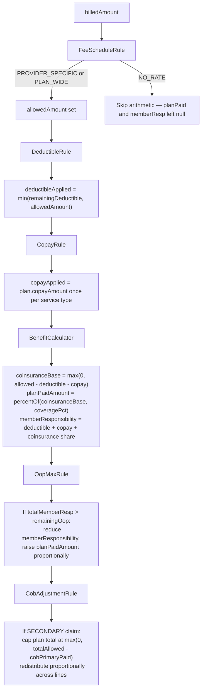
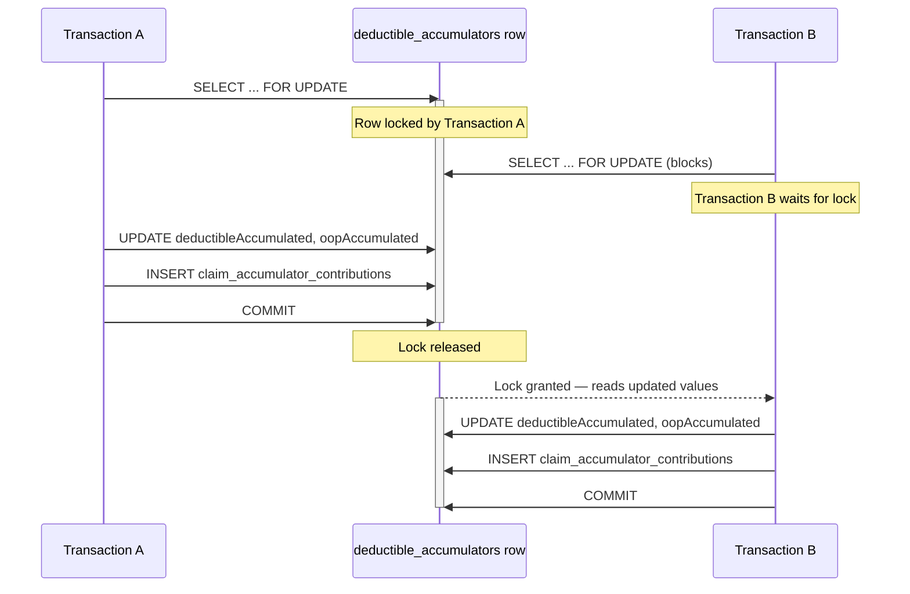

# Adjudication Engine

Self-contained reference for the 13-rule adjudication pipeline in Meridian Claims.
Read alongside [data-model.md](data-model.md), [glossary.md](glossary.md), and
[architecture.md](architecture.md).

---

## 1. Overview

Adjudication is the process that turns a submitted claim into a financial outcome and
routes it to an end state. The engine lives in `AdjudicationService` (orchestrator) and
the `service/adjudication/` package (one class per rule).

### How a claim enters the engine

`ClaimService.submit()` transitions the claim to `SUBMITTED`, then calls
`AdjudicationService.adjudicate()` with `runId = 1`. The call is made inside the
`@Transactional` context that `ClaimService` already holds; `AdjudicationService` joins
that transaction via `Propagation.REQUIRED`.

`ClaimService.reAdjudicate()` (see section 8) calls `adjudicate()` with a new `runId`
computed as `maxRunId(claimId) + 1`.



### What the engine returns

`AdjudicationService.adjudicate()` returns a `ClaimStatus` value. It never returns
`SUBMITTED`. The caller (`ClaimService`) is responsible for applying the
`assertLegalTransition` guard and updating the claim row. Possible return values are:

| Returned status | Meaning |
| --- | --- |
| `DENIED` | A HARD rule failed. |
| `IN_REVIEW` | All rules passed but an automatic-approval condition was not met (see section 7). |
| `APPROVED` | All rules passed and all automatic-approval conditions were met. |

### Outputs written inside the engine

Before returning, `adjudicate()` writes:

1. One `adjudication_results` row per rule (including skipped rules on HARD denial) via
   `AdjudicationResultsDAO.insertBatch()`.
2. Updated financial amounts on each `ClaimLineItem` via
   `ClaimLineItemDAO.updateAmounts()` (written only on non-DENIED outcomes).
3. An updated `deductible_accumulator` row and a new `claim_accumulator_contribution`
   row (written only on non-DENIED outcomes — see section 6).

---

## 2. AdjudicationContext

`AdjudicationContext` is the mutable value object threaded through all 13 rules.
It is constructed once per adjudication run and never shared across threads.

**Immutable inputs set at construction:**

| Field | Type | Description |
| --- | --- | --- |
| `claim` | `Claim` | The claim being adjudicated (snapshotted plan + coverage order). |
| `lineItems` | `List<ClaimLineItem>` | Mutable line-item list; rules write financial fields directly onto each item. |
| `diagnoses` | `List<ClaimDiagnosis>` | Diagnosis codes on the claim. |
| `plan` | `Plan` | Snapshotted plan at submission time. |
| `member` | `Member` | Insured member. |
| `provider` | `Provider` | Submitting provider. |
| `activeCoverage` | `MemberCoverage` | The coverage record active on the date of service. |
| DAO references | — | `ClaimDAO`, `FeeScheduleRateDAO`, `PlanCoverageRuleDAO`, `PriorAuthorizationDAO`, `ReferralDAO` injected from `AdjudicationService`. |

**Mutable fields written by rules:**

| Field | Written by | Used by |
| --- | --- | --- |
| `networkCoveragePct` | `NetworkRule` (#7) | `BenefitCalculator` (#11) as per-line fallback when no service-type rule coverage % exists. Initialized to `Money.ZERO`. |
| `accumulator` | `DeductibleRule` (#9) | `OopMaxRule` (#12), finalization step. |
| `deductibleAppliedThisClaim` | `DeductibleRule` (#9) | Finalization step (replaced by recomputed value from final line state). |
| `oopAppliedThisClaim` | `OopMaxRule` (#12), `CobAdjustmentRule` (#13) | Finalization step. |

---

## 3. AdjudicationRule contract

Every rule implements:

```java
AdjudicationRuleResult evaluate(AdjudicationContext context);
String getRuleName();
String getRuleType();   // "HARD" or "SOFT"
```

`AdjudicationRuleResult` is a simple value object with `boolean passed` and
`String reason`. Constructed via factory methods `passed(reason)` or `failed(reason)`.

---

## 4. HARD vs SOFT distinction and disposition logic



### HARD rules (rules 1-6)

A HARD rule failure is an immediate, unrecoverable denial. When a HARD rule returns
`failed(...)`, the orchestrator:

1. Records the failing rule result.
2. Appends a `skipped` result row for every remaining rule (reason:
   `"skipped — prior hard rule failed: <ruleName>"`).
3. Sets `claim.denialReasonCode` via the mapping in `mapDenialCode()`.
4. Returns `ClaimStatus.DENIED` immediately without touching line-item amounts or
   accumulators.

Denial reason codes by rule:

| Rule | Denial reason code |
| --- | --- |
| `TimelyFilingRule` | `TIMELY_FILING` |
| `EligibilityRule` | `NOT_ELIGIBLE` |
| `DuplicateRule` | `DUPLICATE` |
| `CoverageRule` | `NOT_COVERED` |
| `PriorAuthRule` | `NO_AUTH` |
| `ReferralRule` | `NO_REFERRAL` |

### SOFT rules (rules 7-13)

A SOFT rule that returns `failed(...)` is treated the same as `passed(...)` from the
orchestrator's perspective — execution continues to the next rule. In practice, no
current SOFT rule returns `failed`: they adjust financial amounts or set context fields
and always return `passed(...)` with an informational reason string.

A SOFT rule may pass but produce a signal that later triggers manual review (e.g.,
`FeeScheduleRule` setting `RateSource.NO_RATE`).

### Exception handling

If any rule's `evaluate()` call throws an unchecked exception, the orchestrator catches
it, logs it at ERROR, converts it to `AdjudicationRuleResult.failed(...)`, and treats
the result as if the rule had been a HARD failure (the rule type check still applies).

---

## 5. The 13 rules in order

```mermaid
flowchart LR
    subgraph HARD ["HARD Rules — immediate denial on failure"]
        R1["1 · TimelyFilingRule"]
        R2["2 · EligibilityRule"]
        R3["3 · DuplicateRule"]
        R4["4 · CoverageRule"]
        R5["5 · PriorAuthRule"]
        R6["6 · ReferralRule"]
        R1 --> R2 --> R3 --> R4 --> R5 --> R6
    end

    subgraph SOFT ["SOFT Rules — execution continues on failure"]
        R7["7 · NetworkRule"]
        R8["8 · FeeScheduleRule"]
        R9["9 · DeductibleRule"]
        R10["10 · CopayRule"]
        R11["11 · BenefitCalculator"]
        R12["12 · OopMaxRule"]
        R13["13 · CobAdjustmentRule"]
        R7 --> R8 --> R9 --> R10 --> R11 --> R12 --> R13
    end

    R6 --> R7
    R13 --> DISP["determineDisposition"]
```



### Rule 1 — TimelyFilingRule (HARD)

**What it checks:** Whether the claim was filed within the plan's timely-filing window.

- Exempt claim types: any `ClaimType` other than `ORIGINAL` passes immediately (i.e.,
  `CORRECTED` and `VOID` claims are not subject to timely-filing checks — the window is
  measured on the original).
- For `ORIGINAL` claims: computes `diffDays = (submissionDate - dateOfService) / ms-per-day`.
  Fails if `diffDays > plan.timelyFilingDays`.

**Denial condition:** `diffDays > plan.timelyFilingDays`.

---

### Rule 2 — EligibilityRule (HARD)

**What it checks:** Whether the member has active coverage on the date of service.

- Fails immediately if `activeCoverage == null`.
- Otherwise calls `activeCoverage.isActiveOn(dateOfService)`. Fails if `false`.

---

### Rule 3 — DuplicateRule (HARD)

**What it checks:** Whether an existing claim with the same member, provider, and date
of service already exists in the system.

- Exempt claim types: `CORRECTED` and `VOID` (they are deliberately linked to an
  original and are not duplicates).
- For `ORIGINAL` claims: calls `ClaimDAO.findByMemberAndDOS(memberId, providerId, dos)`.
  Fails if a result is found and its `id` differs from the current claim's `id`.

---

### Rule 4 — CoverageRule (HARD)

**What it checks:** Whether every procedure code on every line item is covered under
the plan.

- Loads all `PlanCoverageRule` rows for the plan (keyed by service type) via
  `PlanCoverageRuleDAO.findByPlanId()`.
- For each line item:
  - Resolves the `serviceType` from the in-memory procedure-code map (built from
    `LookupDAO.findAllProcedureCodes()` at the start of `adjudicate()`).
  - Writes `item.serviceType` and `item.coverageRule` (used by downstream rules).
  - Fails if no matching `PlanCoverageRule` is found for the resolved service type.

**Side effects:** Sets `item.serviceType` and `item.coverageRule` on every line item,
whether the rule passes or fails. These fields are consumed by rules 5, 6, 10, and 11.

---

### Rule 5 — PriorAuthRule (HARD)

**What it checks:** Whether a valid prior authorization exists for procedures that
require it.

- For each line item whose `coverageRule.requiresPriorAuth == true`: calls
  `PriorAuthorizationDAO.findValid(memberId, procedureCode, dateOfService)`.
- Fails on the first line item for which no valid authorization is found.
- Line items whose coverage rule does not require prior auth are skipped.

---

### Rule 6 — ReferralRule (HARD)

**What it checks:** Whether a valid referral exists for services that require one.

- Referral checks apply only to HMO plans (`plan.planType == PlanType.HMO`). All other
  plan types pass immediately.
- For each line item whose `coverageRule.requiresReferral == true`: calls
  `ReferralDAO.findValid(memberId, serviceType, dateOfService)`.
- Fails on the first line item for which no valid referral is found.

---

### Rule 7 — NetworkRule (SOFT)

**What it sets:** `context.networkCoveragePct`, used as the per-line benefit percentage
fallback in `BenefitCalculator` when no service-type-specific coverage percentage is
configured.

- Reads `provider.networkStatus`.
- If `IN_NETWORK`: sets `networkCoveragePct = plan.coveragePctInNetwork`.
- Otherwise: sets `networkCoveragePct = plan.coveragePctOutNetwork`.

Always returns `passed(...)`.

---

### Rule 8 — FeeScheduleRule (SOFT)

**What it sets:** `item.allowedAmount` and `item.rateSource` on each line item.

Lookup order per line item:

1. Provider-specific rate: `FeeScheduleRateDAO.resolveAllowedAmount(planId, providerId, procedureCode, dos)`.
   If found: sets `allowedAmount` and `rateSource = PROVIDER_SPECIFIC`.
2. Plan-wide rate: `FeeScheduleRateDAO.resolveAllowedAmount(planId, null, procedureCode, dos)`.
   If found: sets `allowedAmount` and `rateSource = PLAN_WIDE`.
3. No rate found: sets `allowedAmount = null` and `rateSource = NO_RATE`.

If any line item ends up with `NO_RATE`, the rule still returns `passed(...)` with a
message noting that the claim will route to manual review. The actual routing decision
is made in `determineDisposition()` (see section 7).

**Important:** `NO_RATE` lines have `allowedAmount == null`. All downstream rules that
perform arithmetic check for `null` and skip those lines. `BenefitCalculator` leaves
`planPaidAmount` and `memberResponsibility` as `null` for `NO_RATE` lines.

---

### Rule 9 — DeductibleRule (SOFT)

**What it does:** Acquires the locked accumulator row and applies the remaining
individual deductible across line items in order.

**Accumulator locking (SELECT FOR UPDATE):**
Calls `DeductibleAccumulatorDAO.findOrCreateForUpdate(memberId, planId, benefitYearStart)`.
This issues a `SELECT ... FOR UPDATE` that holds a row-level lock on the
`deductible_accumulators` table for the duration of the enclosing transaction. The lock
prevents concurrent adjudications for the same member-plan-year from applying the
deductible twice. The acquired `DeductibleAccumulator` object is stored on the context
(`ctx.accumulator`) and is held until the transaction commits.

**Deductible application:**

```text
remainingDeductible = max(0, plan.deductibleAmount - acc.deductibleAccumulated)

For each line item (in list order):
  if item.allowedAmount == null:       // NO_RATE line
      item.deductibleApplied = 0
      continue
  toApply = min(remainingDeductible, item.allowedAmount)
  item.deductibleApplied = toApply
  remainingDeductible -= toApply
  totalDeductibleApplied += toApply

ctx.deductibleAppliedThisClaim = totalDeductibleApplied
```

The running total stored in `ctx.deductibleAppliedThisClaim` is informational. The
finalization step (section 6) recomputes the contribution from the final line-item state
to account for downstream adjustments by OopMaxRule and CobAdjustmentRule.

---

### Rule 10 — CopayRule (SOFT)

**What it does:** Applies one copay per distinct service type present on the claim.

- Maintains a set of service types already charged a copay.
- For each line item (in list order):
  - `NO_RATE` lines (`allowedAmount == null`): sets `copayApplied = 0`, skipped.
  - Service type already in the charged set: sets `copayApplied = 0`.
  - First occurrence of a service type: sets `copayApplied = plan.copayAmount`
    (if `plan.copayAmount == null`, uses 0), adds service type to the charged set.

The copay amount comes from a single plan-level field. Per-service-type copay
differentiation is not implemented in the current phase.

---

### Rule 11 — BenefitCalculator (SOFT)

**What it does:** Computes `planPaidAmount` and `memberResponsibility` for each line
item.

For each line item:

- `NO_RATE` lines: sets `planPaidAmount = null`, `memberResponsibility = null`, skips.

For rated lines:

```text
allowed         = item.allowedAmount
deductible      = item.deductibleApplied  (default 0 if null)
copay           = item.copayApplied       (default 0 if null)

coinsuranceBase = max(0, allowed - deductible - copay)

coveragePct     = item.coverageRule.coveragePct  if non-null
                  else ctx.networkCoveragePct     (set by NetworkRule)

planPaid        = Money.percentOf(coinsuranceBase, coveragePct)
memberCoins     = coinsuranceBase - planPaid

item.planPaidAmount        = planPaid
item.memberResponsibility  = deductible + copay + memberCoins
```

`Money.percentOf(amount, pct)` computes `amount * (pct / 100)` at 10-digit internal
scale, then rounds to 2 decimal places with HALF_UP.

---

### Rule 12 — OopMaxRule (SOFT)

**What it does:** Caps total member responsibility at the member's remaining
out-of-pocket maximum for the benefit year, shifting any excess to the plan.

Skips silently if `ctx.accumulator == null`.

```text
oopMax          = plan.oopMax
oopAccumulated  = acc.oopAccumulated
remainingOop    = max(0, oopMax - oopAccumulated)

totalMemberResp = sum of item.memberResponsibility for all items where != null
```

If `totalMemberResp <= remainingOop`: no adjustment; `ctx.oopAppliedThisClaim = totalMemberResp`.

If `totalMemberResp > remainingOop`:

```text
excess = totalMemberResp - remainingOop
```

The excess is distributed proportionally across line items that have both
`memberResponsibility != null` and `planPaidAmount != null`. For each such item:

```text
fraction     = item.memberResponsibility / totalMemberResp  (10-digit scale, HALF_UP)
itemExcess   = Money.scale(excess * fraction)               (rounded to 2dp, HALF_UP)
item.memberResponsibility -= itemExcess
item.planPaidAmount       += itemExcess
distributed  += itemExcess
```

After the loop, any sub-cent residual caused by proportional rounding is absorbed by the
last processed line:

```text
residual = excess - distributed
lastProcessed.memberResponsibility -= residual
lastProcessed.planPaidAmount       += residual
```

This ensures the total shifted equals `excess` exactly. `ctx.oopAppliedThisClaim` is
set to `remainingOop`.

---

### Rule 13 — CobAdjustmentRule (SOFT)

**What it does:** Applies the non-duplication coordination-of-benefits formula for
secondary-payer claims.

Skips immediately (returns `passed(...)`) when:

- `claim.coverageOrder != "SECONDARY"`, or
- `claim.cobPrimaryPaid == null`.

**Formula:**

```text
totalAllowed        = sum of item.allowedAmount  across all lines with != null
normalPlanLiability = sum of item.planPaidAmount across all lines with != null

cap              = max(0, totalAllowed - cobPrimaryPaid)
finalPlanPaid    = min(normalPlanLiability, cap)
```

The worked example from the source comment:
`allowed=$1000, normalLiability=$616, primaryPaid=$500` gives
`finalPlanPaid = min(616, max(0, 1000-500)) = min(616, 500) = $500`.

`finalPlanPaid` and `cobPrimaryPaid` are distributed proportionally across line items
using each line's fraction of `normalPlanLiability`. Per-line member responsibility is
recomputed as:

```text
memberResp = max(0, item.allowedAmount - primaryProportion - itemPlanPaid)
```

Both distributions (plan-paid and primary-paid) may produce sub-cent residuals.
The last processed line absorbs both residuals and recomputes its member responsibility
from the corrected components so that:

- `sum(item.planPaidAmount)` equals `finalPlanPaid` exactly, and
- `sum(primaryProportion)` equals `cobPrimaryPaid` exactly.

After all lines are adjusted, `ctx.oopAppliedThisClaim` is overwritten with the sum
of final `memberResponsibility` values across all lines.

---

## 6. Money arithmetic and rounding

### BigDecimal everywhere

All monetary values are `java.math.BigDecimal`. Database columns are `NUMERIC(12,2)`.
`double` and `float` are never used anywhere in the money path.

### Money utility

`com.meridian.claims.util.Money` is the single home for all monetary arithmetic.
Key constants and methods:

| Symbol | Value / behavior |
| --- | --- |
| `Money.SCALE` | `2` |
| `Money.ROUNDING` | `RoundingMode.HALF_UP` |
| `Money.ZERO` | `BigDecimal.ZERO.setScale(2, HALF_UP)` |
| `Money.scale(v)` | Normalize any `BigDecimal` to scale 2, HALF_UP. |
| `Money.add(a, b)` | `a + b`, scale 2, HALF_UP. Nulls treated as zero. |
| `Money.subtract(a, b)` | `a - b`, scale 2, HALF_UP. Nulls treated as zero. |
| `Money.multiply(a, b)` | `a * b`, scale 2, HALF_UP. Nulls treated as zero. |
| `Money.percentOf(amount, pct)` | `amount * (pct / 100)`. Division uses scale 10, HALF_UP internally; result scaled to 2. |
| `Money.min(a, b)` | Smaller value at scale 2. Nulls treated as zero. |
| `Money.max(a, b)` | Larger value at scale 2. Nulls treated as zero. |

### Per-line money calculation flow



The full calculation for a single rated line item in sequence:

```text
1. allowedAmount          (set by FeeScheduleRule — PROVIDER_SPECIFIC or PLAN_WIDE)
2. deductibleApplied      (set by DeductibleRule — at most allowedAmount, fills remaining deductible)
3. copayApplied           (set by CopayRule — plan.copayAmount, once per distinct service type)
4. coinsuranceBase        = max(0, allowedAmount - deductibleApplied - copayApplied)
5. coveragePct            = coverageRule.coveragePct ?? networkCoveragePct
6. planPaidAmount         = percentOf(coinsuranceBase, coveragePct)
7. memberResponsibility   = deductibleApplied + copayApplied + (coinsuranceBase - planPaidAmount)
   [OopMaxRule may reduce memberResponsibility and raise planPaidAmount]
   [CobAdjustmentRule may reduce planPaidAmount for secondary claims]
```

### Proportional distribution and last-line residual absorption

When any amount must be split across multiple line items proportionally (OopMaxRule
distributes `excess`, CobAdjustmentRule distributes `finalPlanPaid` and `cobPrimaryPaid`),
the following pattern is used:

1. Compute each item's share as `Money.scale(total * fraction)` (HALF_UP to 2dp).
2. Accumulate distributed amounts.
3. After the loop, compute `residual = total - distributed`.
4. Add the residual to the last processed line and recompute that line's dependent fields.

This is deterministic and audit-friendly: the residual is never more than a fraction of
one cent per distribution, and it always lands on the last line.

---

## 7. Post-rule disposition (determineDisposition)

After all 13 rules have run and line amounts have been written, `determineDisposition()`
decides the final `ClaimStatus`. Conditions are evaluated in order; the first match wins:

| Condition | Returned status |
| --- | --- |
| Any line item has `rateSource == NO_RATE` | `IN_REVIEW` |
| `claim.claimType == CORRECTED` | `IN_REVIEW` |
| `claim.coverageOrder == "SECONDARY"` | `IN_REVIEW` |
| `sum(item.planPaidAmount) > autoApproveThreshold` | `IN_REVIEW` |
| None of the above | `APPROVED` |

### Auto-approve threshold

Configurable via property `claims.auto.approve.threshold` (default `500.00`). The value
is parsed with `Money.of(str)` (BigDecimal, scale 2, HALF_UP). Claims with total plan
liability exceeding this threshold are routed to manual review regardless of other
conditions.

---

## 8. Re-adjudication

`ClaimService.reAdjudicate(claimId, userId)` is available for claims in `DENIED` or
`IN_REVIEW` status.

### What changes on a re-adjudication run

1. **New run ID:** `runId = adjudicationResultsDAO.maxRunId(claimId) + 1`. Prior result
   rows are never overwritten; every run appends its own set of rows keyed by `runId`.

2. **Accumulator reversal:** If a prior `ClaimAccumulatorContribution` row exists for the
   claim and has not already been reversed, `VoidReversalService.reverse()` is called to
   subtract the prior deductible and OOP contribution from the accumulator before the new
   run acquires its lock.

3. **Entity reload:** Member, provider, plan, active coverage, line items, and diagnoses
   are all reloaded from the database. The claim is adjudicated against current data.

4. **State-machine constraint:** If the claim's current status is `DENIED`, the engine's
   result is coerced to `IN_REVIEW` before the transition is applied. The state machine
   does not allow `DENIED -> APPROVED` directly; a human reviewer makes the final call.
   If the current status is `IN_REVIEW`, the engine's result is applied directly.

### Finalization is identical

The same `writeAccumulatorContribution()` and `claimLineItemDAO.updateAmounts()` paths
run at the end of every adjudication call, including re-adjudications.

---

## 9. Accumulator SELECT FOR UPDATE pattern

The `deductible_accumulators` table has one row per (member, plan, benefit_year_start).
Concurrent claims for the same member and plan year must not interleave their deductible
and OOP calculations.

The lock is acquired by `DeductibleAccumulatorDAO.findOrCreateForUpdate()` in
`DeductibleRule.evaluate()`. The call issues `SELECT ... FOR UPDATE`, which holds a
row-level exclusive lock until the enclosing transaction commits or rolls back.

The acquired `DeductibleAccumulator` object is stored on `AdjudicationContext.accumulator`
and read by `OopMaxRule` (rule 12) and the finalization step in `writeAccumulatorContribution()`.



### Accumulator contribution record

After all rules complete (non-DENIED outcome), `writeAccumulatorContribution()` writes
a `claim_accumulator_contributions` row. The contribution values are computed from the
final line-item state rather than the mid-chain running totals, because `OopMaxRule`
and `CobAdjustmentRule` can lower member responsibility after `DeductibleRule` ran:

```text
oopContrib         = sum of item.memberResponsibility for lines with != null
deductibleContrib  = min(sum of item.deductibleApplied, oopContrib)
```

The `min()` guard on `deductibleContrib` ensures the deductible contribution never
exceeds the final OOP contribution (relevant when the OOP cap reduced member responsibility
below the deductible amount applied mid-chain).

The accumulator row is then updated:

```text
acc.deductibleAccumulated += deductibleContrib
acc.oopAccumulated        += oopContrib
```

### Reversal

On `VOID` and on re-adjudication, `VoidReversalService.reverse()` is called. It finds the
`claim_accumulator_contributions` row for the claim, subtracts both contribution amounts
from the accumulator, and marks the contribution row `reversed = true`. This makes
accumulator adjustments exactly reversible.

---

## 10. adjudication_results table and audit trail

Every call to `adjudicate()` writes one row per rule to `adjudication_results`:

| Column | Value |
| --- | --- |
| `claim_id` | The claim being adjudicated. |
| `run_id` | The adjudication run number (1 for initial, increments on re-adjudication). |
| `step_number` | 1-based rule position in the chain. |
| `rule_name` | `AdjudicationRule.getRuleName()` string (e.g. `"TimelyFilingRule"`). |
| `rule_type` | `"HARD"` or `"SOFT"`. |
| `passed` | `true` or `false`. |
| `reason` | Human-readable explanation from the rule result. |

Skipped rules (after a HARD denial) appear with `passed = false` and a reason of the form
`"skipped — prior hard rule failed: <ruleName>"`.

Multiple run records accumulate over the claim's lifetime; no run is ever deleted.
