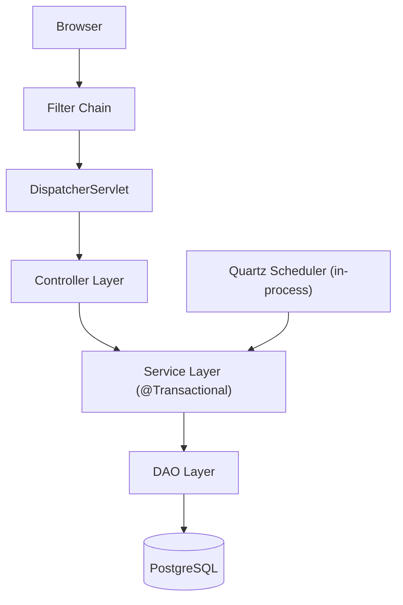
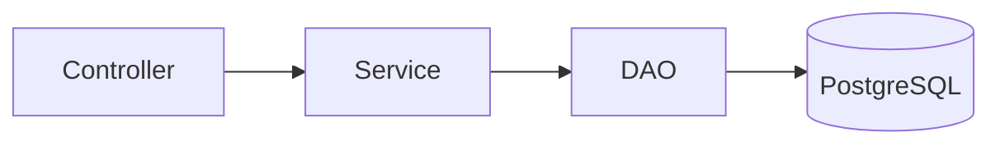
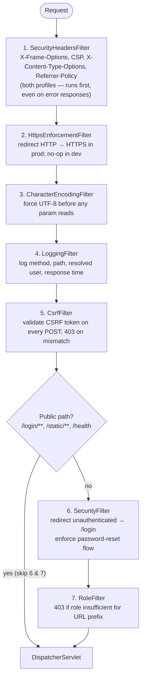
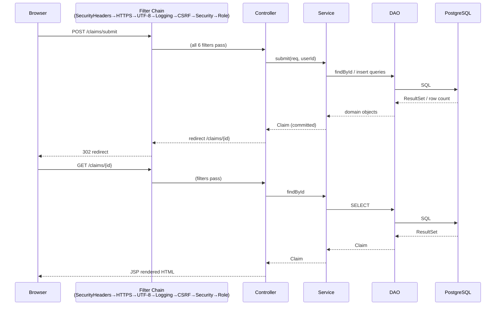
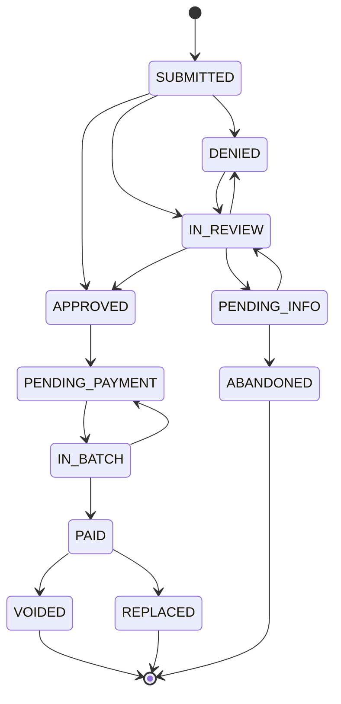
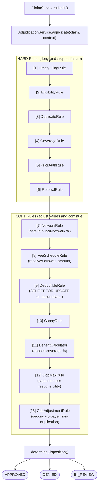

# Architecture

A code-oriented reference for developers onboarding to Meridian Claims. Covers
layers, request lifecycle, filter chain, transaction model, concurrency strategy,
scheduled jobs, and key design decisions.

For the adjudication rule pipeline see [adjudication.md](adjudication.md). For
the full domain schema see [data-model.md](data-model.md). For Quartz job
schedules and operations see [scheduled-jobs.md](scheduled-jobs.md).

---

## 1. System Overview

Meridian Claims is a single deployable WAR running on Tomcat 9. There are no
microservices, no message queues, and no event sourcing. Everything — web
request handling, business logic, scheduled jobs, and database access — lives
in one in-process JVM.



---

## 2. Four-Layer Architecture

Dependencies point strictly downward. No layer skips over an adjacent one.



| Layer      | Package                                  | Rule                                                                                                                                                      |
| ---------- | ---------------------------------------- | --------------------------------------------------------------------------------------------------------------------------------------------------------- |
| Controller | `com.meridian.claims.controller`         | Spring MVC `@Controller`. Handles HTTP only: parse input, call one or more services, choose a view or redirect. Never touches JDBC or `JdbcTemplate`.     |
| Service    | `com.meridian.claims.service`            | All business logic lives here. Owns `@Transactional` boundaries. Never returns raw `ResultSet` or SQL artefacts.                                          |
| DAO        | `com.meridian.claims.dao`                | JDBC only. Holds `SELECT`/`INSERT`/`UPDATE`/`DELETE` strings. No business rules whatsoever.                                                               |
| Database   | PostgreSQL                               | Relational data, Flyway-managed schema.                                                                                                                   |

Additional packages that support the four layers:

- `com.meridian.claims.model` — Plain POJOs. No annotations, no ORM mappings.
- `com.meridian.claims.web` — Servlet filters (security, CSRF, logging, etc.).
- `com.meridian.claims.job` — Quartz job classes that delegate to services.
- `com.meridian.claims.util` — Stateless helpers (`DateUtil`, `ClaimNumberGenerator`, `CsvWriter`, `Page<T>`, `Money`, etc.).
- `com.meridian.claims.service.adjudication` — One class per adjudication rule, all pure domain logic with no web dependency.

---

## 3. Spring Application Contexts

Spring creates two nested contexts, following the standard Spring MVC dual-context
pattern.

### Root context (`applicationContext.xml`)

Loaded by `ContextLoaderListener` at startup. Contains:

- `DataSource` (Apache DBCP2 connection pool)
- `JdbcTemplate` (single shared instance injected into `BaseDAO`)
- `DataSourceTransactionManager` + `<tx:annotation-driven/>` (enables `@Transactional`)
- All `@Service` and `@Repository` beans (component-scanned, controllers excluded)
- Mail sender (`JavaMailSenderImpl` / `LoggingMailService`)
- Quartz `SchedulerFactoryBean` with all job details and triggers
- `AppProfile` bean (dev or prod, resolved from `-Dclaims.profile` or `CLAIMS_PROFILE`)
- `StartupValidator` (fail-fast: checks profile, runs Flyway, verifies DB connectivity)

### Web context (`servlet-context.xml`)

Loaded by the `DispatcherServlet`. Contains:

- `@Controller` beans only (component-scanned from `com.meridian.claims.controller`)
- `<mvc:annotation-driven/>` (enables `@RequestMapping` handler methods)
- `InternalResourceViewResolver` mapping logical names to `/WEB-INF/views/<name>.jsp`
- Static resource handler (`/static/**` served directly, bypasses controllers)

The web context is a child of the root context: controllers can inject services,
but services cannot see controllers.

### Property resolution order

Properties are resolved in this order (later files override earlier keys):

1. `classpath:db.properties` — JDBC and pool defaults (dev literals)
2. `classpath:application.properties` — application config defaults
3. `file:${catalina.base}/conf/meridian-claims-prod.properties` — production
   overrides (SMTP, larger pool, etc.)

The production properties file is external to the WAR and never packaged in it,
so credentials never sit on the classpath. In development the file is absent and
silently skipped (`ignore-resource-not-found="true"`).

---

## 4. Filter Chain

Filters are declared in `web.xml`. The order is determined by `<filter-mapping>`
declaration order, which is:



**Public paths** (always passed through, skip steps 6 and 7):
`/login/**`, `/static/**`, `/health`

**Security filter details** (`SecurityFilter.java`):

- Checks `session.getAttribute(SESSION_USER_KEY)` for a `User` object.
- If absent, redirects to `/login`.
- If present but `user.forceReset || user.passwordExpired`, redirects to
  `/password/change` unless the path is already `/password/**` or `/logout`.

**Role filter details** (`RoleFilter.java`):

| URL prefix                                                         | Required role(s)                                                                         |
| ------------------------------------------------------------------ | ---------------------------------------------------------------------------------------- |
| `/admin/**`                                                        | ADMIN only                                                                               |
| `/finance/**`                                                      | FINANCE or ADMIN                                                                         |
| `/review/**`                                                       | REVIEWER or ADMIN                                                                        |
| `/analyst/**`                                                      | ANALYST or ADMIN                                                                         |
| `/members`, `/providers`, `/prior-auth`, `/referrals`, `/claims`   | ANALYST is read-only (GET/HEAD only); all other authenticated roles may read and write   |
| All other paths                                                    | Any authenticated user                                                                   |

---

## 5. Request Lifecycle



For a GET request the lifecycle is the same except no CSRF check fires and no
`@Transactional` write transaction is needed (read-only transactions may still
be opened by the service if needed).

---

## 6. Transaction Model

### Boundary

`@Transactional` is applied at the **service layer only**. Controllers are not
transactional. DAOs participate in whatever transaction the service opened —
they never open their own.

The transaction manager is `DataSourceTransactionManager` backed by DBCP2. All
JDBC operations that share the same Spring transaction context share the same
`Connection`.

### Optimistic locking on claims

The `claims` table carries a `version INTEGER` column. Every mutating DAO
method (`updateStatus`, `assignTo`, `update`) uses an `AND version = ?` predicate
and increments the version:

```sql
UPDATE claims
SET    status = ?, status_entered_at = NOW(), version = version + 1
WHERE  id = ? AND version = ?
```

If zero rows are updated, the DAO throws `DAOException` (lost-update detected).
The service layer surfaces this as a concurrency error to the caller. No external
lock is held; concurrent readers are never blocked.

### Pessimistic locking on accumulators

Deductible and out-of-pocket accumulator rows use `SELECT ... FOR UPDATE` inside
the adjudication transaction. This serializes concurrent claim submissions for
the same member/plan/benefit-year, preventing double-spend on shared accumulators.

Pattern (from `JdbcDeductibleAccumulatorDAO`):

```text
1. INSERT a zero-row if none exists (ignore duplicate-key on concurrent insert)
2. SELECT ... FOR UPDATE   <-- blocks until prior transaction commits
3. compute new accumulated amount
4. UPDATE accumulator row
5. INSERT a ClaimAccumulatorContribution row (reversibility audit trail)
```

The contribution rows make accumulator changes fully reversible: a VOID or
re-adjudication reverses each contribution row before recomputing.

### State machine guard

`ClaimService.assertLegalTransition(fromStatus, toStatus)` is the single
enforcement point for the claim status state machine. Every method in
`ClaimService` that transitions status calls this before making any change.
The legal-transition map is defined once as a static final field in
`ClaimService.LEGAL_TRANSITIONS` and is the single enforcement point for
all status changes in the application.



---

## 7. DAO Pattern

All DAO implementations extend `BaseDAO`, which holds the single application-wide
`JdbcTemplate` injected from the root Spring context.

Each domain entity has:

- An interface (e.g., `ClaimDAO`) defining the contract
- A `Jdbc`-prefixed implementation (e.g., `JdbcClaimDAO`) with hand-written SQL

Each `Jdbc*DAO` contains a private `RowMapper` inner class that maps a `ResultSet`
row to the model POJO. These per-DAO mappers are intentional and are not
consolidated — they are idiomatic to this style.

SQL strings are plain `String` constants. No JPQL, no Criteria API, no named
queries. `PreparedStatement` parameters are always positional `?` placeholders
(never string-concatenated values) to prevent SQL injection.

---

## 8. Adjudication Pipeline

`AdjudicationService` is pure domain logic. It has no `HttpServletRequest`,
no session, and no web dependency — it can be called from a controller, a
Quartz job, or a unit test with equal ease.

The pipeline runs 13 rules in a fixed order. HARD rules deny-and-stop on failure;
SOFT rules adjust values and continue. See [adjudication.md](adjudication.md) for
the full rule table and money-calculation details.



---

## 9. Scheduled Jobs

Quartz runs in-process. The `SchedulerFactoryBean` is defined in
`applicationContext.xml` and starts alongside the root Spring context.

Because Quartz instantiates job classes itself (outside Spring), a custom
`AutowiringSpringBeanJobFactory` overrides the default instantiation to
inject `@Autowired` and `@Value` fields after construction. This lets job
classes use the same Spring beans as controllers and services.

Jobs call service-layer methods and do not contain business logic themselves.
The scheduler waits for running jobs to finish before shutdown
(`waitForJobsToCompleteOnShutdown=true`).

Every run is logged to `scheduled_job_log` (started, completed, status,
records processed).

| Job                          | Default schedule | Purpose                                                |
| ---------------------------- | ---------------- | ------------------------------------------------------ |
| `SlaEscalationJob`           | Hourly at :00    | Flag claims past SLA; email supervisor                 |
| `AppealSlaEscalationJob`     | Hourly at :30    | Flag appeals past deadline; email supervisor           |
| `StaleClaimJob`              | Nightly 02:00    | Abandon PENDING_INFO claims past due date              |
| `BenefitYearRolloverJob`     | Nightly 03:00    | Log prior-year accumulator anomalies                   |
| `SlowQueryReportJob`         | Nightly 04:00    | Email DBA slow queries from pg_stat_statements         |
| `ClaimArchiveJob`            | Nightly 01:00    | Move terminal claims past retention to claims_archive  |
| `InboundClaimFilePollerJob`  | Every 5 min      | Poll shared inbound dir; parse FHIR/EDI files; submit claims |
| `TradingPartnerPollerJob`    | Every 10 min     | Poll each active trading partner's own transport; submit claims; deliver acks back to that partner |

Cron expressions are all overridable via properties (see [configuration.md](configuration.md)).

---

## 10. Batch Claim Intake Pipeline

The batch intake pipeline enables electronic claim submission without any UI interaction.
Claims auto-adjudicate through the same 13-rule engine as manual submissions; only
exceptions surface in the existing reviewer worklist.

### Design principles

- **Single adjudication path** — either poller → `IntakeService` → `ClaimService.submit()` →
  `AdjudicationService`. No parallel code path.
- **Parser seam** — `ClaimFileParser` interface decouples format parsing from the pipeline.
  New formats plug in by implementing this interface; nothing else changes. Extension→parser
  dispatch is a single shared `ParserResolver`, used by both pollers.
- **Per-record fault isolation** — one malformed record is quarantined individually; the
  rest of the file continues processing. Only a structurally unparseable file (bad JSON,
  unrecognised format) is a file-level failure.
- **SHA-256 idempotency** — each file is keyed by its content hash in `claim_intake_batches`.
  Re-dropping the same file is always a no-op.
- **Off-session attribution** — the job runs outside any HTTP session. `AuditService` and
  `PhiAccessLogService` write `user_id = NULL` (null-safe by design). Claims are attributed
  to the seeded `system` user (`created_by_user_id`).
- **Transport seam** (Phase 13) — `TransportAdapter` decouples *where* a file comes from
  (shared local directory vs. a specific trading partner's local/SFTP endpoint) from
  everything downstream of it; `IntakeService`/`ClaimService` are unaware which poller called them.

### Component map

```
InboundClaimFilePollerJob (shared directory)      TradingPartnerPollerJob (per active partner)
  │                                                  │
  │  reads claims.intake.path directly               │  TransportAdapterResolver.resolve(partner)
  │                                                  │    ├── LocalDirectoryTransportAdapter (default)
  │                                                  │    └── SftpTransportAdapter (JSch)
  │                                                  │
  └──────────────────┬───────────────────────────────┘
                      │
              ParserResolver.resolve(fileName)
                ├── .json  → FhirClaimFileParser   (FHIR R4 Claim JSON, single resource or Bundle)
                └── .edi / .x12 / .837 → X12Edi837Parser  (X12 837P professional / 837I institutional)
                      │
              IntakeService.processFile(fileName, content, parser[, tradingPartnerId])
                ├── SHA-256 hash → claim_intake_batches (idempotency check)
                ├── parser.parse(content) → ClaimFileParseResult
                │     ├── getClaims()        — successfully parsed SubmitClaimRequests
                │     └── getRecordErrors()  — per-record failures (quarantined, not thrown)
                ├── ClaimService.submit(req, systemUserId)  [one per good record]
                ├── update claim_intake_batches (COMPLETED / FAILED + counts)
                └── if X12: generate 999/277CA/TA1 → edi_transactions (tagged with tradingPartnerId)
                      │
              TradingPartnerPollerJob only: EdiTransactionDAO.findByFileReference(fileName)
                → pushes each ack's content back through that partner's own outbound transport
```

### Supported formats

| Format | Extension | Parser | Key mapped fields |
| ------ | --------- | ------ | ----------------- |
| FHIR R4 Claim JSON | `.json` | `FhirClaimFileParser` (Jackson) | `patient.identifier` → member; `provider.identifier` → NPI; `billablePeriod.start` → DOS; `diagnosis[]` → ICD-10; `item[]` → CPT + charge |
| X12 EDI 837P / 837I | `.edi` `.x12` `.837` | `X12Edi837Parser` (StAEDI) | NM1\*IL → member; NM1\*82/85 → provider NPI; DTP\*472 → DOS; HI → ICD-10; SV1/SV2 → line item; ISA13 → `external_reference` |

### Outbound EDI 835

`Edi835Generator` (Spring service) produces X12 835 remittance advice from an existing
`RemittanceBatch` + its items using the StAEDI streaming writer. The full
ISA→GS→ST→BPR→CLP→SVC→CAS→AMT→SE→GE→IEA envelope is emitted; all amounts are
`BigDecimal.toPlainString()`. The Finance screen exposes a "Download 835" link on each
remittance batch detail page. Optionally writes files to disk via `claims.remittance.edi.output.path`.
`Edi835Generator`, `Edi999Generator`, `Edi277CaGenerator`, `Edi277Generator`,
`Edi278ResponseGenerator`, and `Edi270Generator` share their ISA/GE/IEA envelope-writing logic via `EdiEnvelopeWriter`
(extracted during the Phase 12 duplication sweep). `Edi277CaGenerator` and `Edi277Generator`
additionally share `EdiEnvelopeWriter.writeTrnAndStc` (Phase 14 sweep); when
`Edi278ResponseGenerator` needed the same TRN segment but a different second segment (UM, not
STC), `writeTrnAndStc` was split into standalone `writeTrn` + `writeStc` so all three generators
reuse the TRN half without forcing an STC-shaped abstraction onto UM (Phase 15 sweep).

### EDI acknowledgments (Phase 12)

Every inbound X12 837 file automatically gets an acknowledgment, generated inline inside
`IntakeService.processFile` — no separate job. `Edi999Generator` produces the functional
acknowledgment (AK1/AK2/AK5/AK9, referencing the inbound file's own GS06/ST02 control numbers)
and the TA1 interchange reject for structurally invalid interchanges; `Edi277CaGenerator`
produces the claim-level acknowledgment (STC status per transaction, keyed to
`claims.external_reference`/ISA13). All three are logged to `edi_transactions`, viewable at
Admin → Integrations.

### Trading-partner transport (Phase 13)

`TradingPartnerPollerJob` polls every active `trading_partners` row independently of the
shared directory poller above. Each partner has its own transport (`LOCAL` directory or
`SFTP`, resolved by `TransportAdapterResolver`) and its own inbound/outbound paths.
Credentials for SFTP partners are never stored on the partner record — only a
`transport_credential_ref` key name, resolved at connect time from the external prod overlay.
One partner's transport failure is logged and that partner skipped; it never stops the others.

### Claim status inquiry (Phase 14)

A `.276` file is recognised by `StatusInquiryFileMatcher` — checked by both pollers *before*
the claim-submission dispatch above — and routed to `ClaimStatusInquiryService` instead of
`IntakeService`. This is a read-only query: `X12Edi276Parser` extracts the inquiry (claim
number if the submitter has it, else member+provider+date-of-service), the service resolves
it against `claims`, and `Edi277Generator` produces the response (`stcFor(ClaimStatus)` maps
every status to an X12 STC code). Both the inbound 276 and outbound 277 are logged to
`edi_transactions` exactly like an 837/999 pair, so the trading-partner poller's existing
ack-delivery step (`findByFileReference` → push through the partner's transport) handles
delivery with no special-casing.

### Prior authorization request (Phase 15)

A `.278` file is recognised by `PriorAuthRequestFileMatcher` — the same seam pattern as
`StatusInquiryFileMatcher`, checked right after it. Unlike a 276, this **does** mutate state:
`X12Edi278Parser` extracts the request, `PriorAuthRequestService` validates and resolves it
(member, provider, procedure code, requested certification period), and — for anything that
certifies — calls the existing `PriorAuthorizationService.createAuthorization` directly, so a
278-sourced authorization is created through the exact same path staff use when entering one
manually. `Edi278ResponseGenerator` reports the outcome as a UM certification code (`A1`
certified / `A3` not certified — no pended state, since `PriorAuthStatus` doesn't have one).
Logged to `edi_transactions` the same way as 276/277; delivery reuses the trading-partner
poller's existing ack-delivery step unchanged.

### Real-time eligibility inquiry (Phase 16)

Unlike every prior electronic transaction, Meridian is the **requester** for 270/271, not the
responder — this is triggered by a "Check Eligibility" action on the member screen, not an
inbound file. `EligibilityCheckService` builds the outbound request via `Edi270Generator`, sends
it through the `EligibilityClient` seam, parses the response with `X12Edi271Parser`, maps the
EB01 eligibility/benefit code to `ACTIVE`/`INACTIVE`/`ERROR`, and persists the result to
`eligibility_checks` (a dedicated table, not `edi_transactions` — this is a member-scoped check
event, not a trading-partner file exchange). `EligibilityClient`'s only implementation,
`MockEligibilityClient`, is the dev-safe default that plays the same role
`LoggingMailService` plays for `MailService`: no live clearinghouse partner exists yet, so it
synthesizes a realistic 271 from the member's own `member_coverage` rows
(`MemberCoverageDAO.findActiveByMemberId` + `MemberCoverage.isActiveOn(now)`) instead of calling
out anywhere. The member-detail screen (`members/view.jsp`) shows the last 10 checks in an
"Eligibility Check History" panel.

### Enrollment ingestion (Phase 17)

A `.834` file is recognised by `EnrollmentFileMatcher` — checked by both pollers after the 276
and 278 checks, ahead of the claim-submission dispatch. `X12Edi834Parser` extracts one
`EnrollmentRecord` per INS loop (a file may enroll many members in one transaction).
`EnrollmentIntakeService` dispatches by X12 834 maintenance type code: **021 (Add)** creates the
member via `MemberService.createMember` if not already known, then adds a PRIMARY coverage
record via `MemberService.addCoverage` when the file carries a resolvable plan (`PlanDAO.findByName`
against HD04) and effective date; **024 (Termination)** finds the member's open-ended coverage
record matching the file's plan and stamps a termination date via `MemberService.updateCoverage`;
**001 (Change)** updates only member demographics via `MemberService.updateMember`, preserving
address/phone/email — coverage changes arrive in practice as a paired 024 (end old) + 021 (start
new), so Change deliberately never touches coverage. Like Phase 9's claim intake, this has its
own file-level SHA-256 idempotency ledger (`enrollment_batches`) since a redundant enrollment
file must be a safe no-op, not a duplicate member or coverage row. Unlike every prior ancillary
transaction type, an 834 has no response document — enrollment is one-way — so the
trading-partner poller's ack-delivery step is skipped for it entirely.

### EFT/ACH payment issuance (Phase 18)

Triggered automatically when a payment batch is exported (`PaymentBatchService.exportCsv`), right
alongside the existing 835 remittance generation — not a separate user action. `EftPaymentService`
groups the batch's `RemittanceBatchItem`s by provider (`providerId`, already captured on each
item), sums the plan-paid amount per provider, and builds one NACHA credit entry per provider
that has ACH banking info configured (`providers.ach_routing_number`/`ach_account_number`/
`ach_account_type`). A provider with none configured is simply **skipped** — not fatal — so a
batch with a mix of configured and unconfigured providers issues a partial ACH file and stays
check-paid for the rest, exactly as the whole batch always was before this phase. `AchFileWriter`
(`com.meridian.claims.util`) builds the actual fixed-width NACHA CCD+ file: File Header, Batch
Header, one Entry Detail + Addenda record (carrying the TRN reassociation number) per provider,
Batch Control, File Control, padded to a multiple of 10 records with `9`-filler lines — with real
position-accurate control totals (entry hash, credit total, entry/addenda count), not just a
plausible-looking format.

The TRN reassociation number (`"EFT" + zero-padded payment-batch id`) is stamped on **both** the
ACH addenda record and the paired 835's TRN02 segment — `Edi835Generator` gained a 3-arg overload
for this; the original 2-arg signature still exists and delegates with `null`, so every
check-paid batch generates its 835 exactly as before. When a reassociation number is present, the
835's BPR04 payment-method code also switches from `CHK` to `ACH`, so the remittance advice itself
reflects how the provider was actually paid. The result — TRN, amount, entry/skipped-provider
counts, and a manually-tracked settlement status (no live bank feed exists to detect it
automatically) — is recorded in `eft_payments`, one row per payment batch. The Finance batch
detail screen exposes a **Download ACH File** link (regenerated on demand from the persisted TRN
and current provider banking data — no raw NACHA text is stored in the DB, the same on-demand
pattern the existing "Download 835" link already used) and a **Mark Settled** button.

---

## 11. Security Model

### Security response headers

`SecurityHeadersFilter` is the first filter in the chain. It sets `X-Frame-Options: DENY`,
`X-Content-Type-Options: nosniff`, `Content-Security-Policy` (default-src / script-src self,
style-src self + unsafe-inline for JSTL-generated styles, object-src none), and
`Referrer-Policy: strict-origin-when-cross-origin` on every response including error pages.
It is not gated by profile — the headers are safe over plain HTTP and do not impede
local development.

### Session

- Cookie name: `JSESSIONID`, tracking mode: `COOKIE` only (URL rewriting disabled).
- `HttpOnly` set in `web.xml` session cookie config.
- `SameSite=Strict` set in `META-INF/context.xml` (Tomcat `CookieProcessor`).
- Under production (HTTPS), `Secure` is enforced by `ProdSecureCookieListener`
  which runs before `ContextLoaderListener` so the flag is locked before any
  session is created.
- Idle timeout: 30 minutes.
- `SessionCleanupListener` closes the `user_sessions` DB row when a session
  expires or is invalidated, including idle timeout.

### Authentication

`AuthenticationService` handles login and stores the `User` object at
`SESSION_USER_KEY` in the `HttpSession`. `SecurityFilter` reads this key on every
request.

Forced password-reset: if `user.forceReset` or `user.passwordExpired` is true,
`SecurityFilter` redirects every request to `/password/change` until the user
sets a new password.

### CSRF

`CsrfFilter` validates a token on every POST. The token is stored in the session
and embedded in every form via a JSP tag. A mismatch returns HTTP 403.

### Role-based access control

Five roles: `ADMIN`, `STAFF`, `REVIEWER`, `FINANCE`, `ANALYST`.

`RoleFilter` enforces URL-prefix gates (see Section 4). `ANALYST` is the
read-only reporting role: it may access all domain data via GET but cannot
mutate it.

### Audit and PHI access logging

Three distinct audit channels exist by design and are not consolidated:

- `audit_log` — general application audit (logins, config changes, admin actions)
- `claim_audit` — claim-lifecycle events (status transitions, adjudication outcomes)
- `phi_access_log` — PHI access events (member record reads, EOB views)

---

## 12. Key Design Decisions

### No ORM

The project uses plain JDBC via `JdbcTemplate` and hand-written SQL. There is
no Hibernate, no JPA, and no Spring Data. This is intentional:

- SQL is explicit, readable, and predictable.
- Query plans can be tuned directly.
- No lazy-loading surprises or N+1 footguns.
- The `SELECT ... FOR UPDATE` accumulator pattern requires explicit transaction
  control that is awkward to express through ORM.

The trade-off is more boilerplate in DAOs (per-entity `RowMapper`, explicit column lists). That is accepted.

### BigDecimal for all money

All monetary values are `java.math.BigDecimal` in Java and `NUMERIC(12,2)` in
PostgreSQL. `double`/`float` are never used in the money path because they cannot
represent decimal fractions exactly. All arithmetic uses `RoundingMode.HALF_UP`.
The `Money` utility class in `com.meridian.claims.util` is the single home for
shared monetary arithmetic.

### XML Spring configuration

`applicationContext.xml` and `servlet-context.xml` are the source of truth for
wiring. Annotation-based configuration (`@Configuration`, `@Bean`) is not used.
`@Service`, `@Repository`, and `@Controller` stereotypes are used only for
component scanning; the actual wiring of infrastructure beans (datasource, pool,
transaction manager, Quartz) is explicit XML. This keeps the startup sequence
readable in one file.

### Java 8 language level, explicit style

No records, no `var`, minimal lambdas and streams. Explicit getters, setters,
and constructors; no Lombok. `for` loops over streams. This is a deliberate
choice to maintain a readable, legacy-enterprise style consistent with the
internal tooling environment.

### Error pages

`web.xml` declares error pages for 400, 403, 404, and 500 mapped to
`/WEB-INF/views/error/*.jsp`. Unhandled `Throwable` also routes to the 500 page.

---

## 13. Package Reference

```text
com.meridian.claims/
  controller/              Spring MVC @Controller classes
  dao/                     DAO interfaces + JdbcXxx implementations + BaseDAO
  job/                     Quartz job classes + AutowiringSpringBeanJobFactory
  model/                   Plain POJOs: Member, Claim, ClaimLineItem, Payment, ...
  service/                 Business logic @Service classes
  service/adjudication/    One class per AdjudicationRule; AdjudicationService
  util/                    Stateless helpers: DateUtil, ClaimNumberGenerator,
                           CsvWriter, Page<T>, Money, AppProfile, ...
  web/                     Servlet filters: SecurityHeadersFilter,
                           HttpsEnforcementFilter, LoggingFilter, CsrfFilter,
                           SecurityFilter, RoleFilter
                           Listeners: ProdSecureCookieListener, SessionCleanupListener
```

---

## 14. Related Docs

- [data-model.md](data-model.md) — full schema and entity reference
- [adjudication.md](adjudication.md) — rule pipeline and money-calculation detail
- [scheduled-jobs.md](scheduled-jobs.md) — job schedules, cron keys, operations
- [security.md](security.md) — security controls in depth
- [configuration.md](configuration.md) — all configurable properties
- [getting-started.md](getting-started.md) — local dev setup
