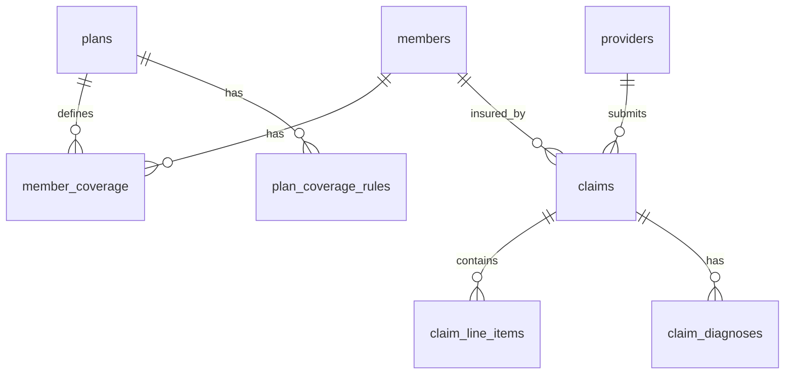
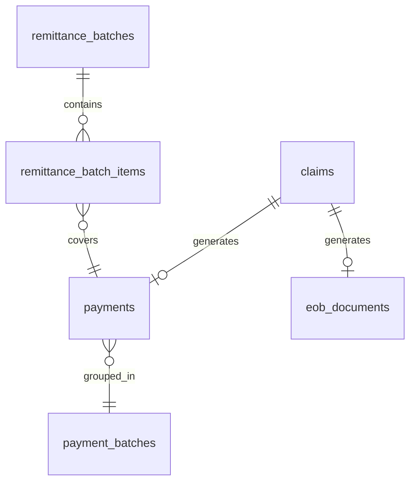

# Data Model

Physical schema reference for Meridian Claims. All information is derived directly from the Flyway migration files in `src/main/resources/db/migration/`. The H2 test stubs under `src/test/resources/db/migration/` mirror the prod end-state.

---

## Migration History

| Version | File | Scope |
| --------- | ------ | ------- |
| V1 | `V1__initial_schema.sql` | `users`, `audit_log`; base schema conventions established |
| V2 | `V2__updated_at_trigger_and_audit_index.sql` | `set_updated_at()` trigger function; `updated_at` triggers on `users`; composite index `(entity_type, entity_id)` on `audit_log` |
| V3 | `V3__phase2_user_sessions.sql` | `user_sessions` — login/logout tracking |
| V4 | `V4__phase3_core_domain.sql` | Core domain: `members`, `providers`, `plans`, `plan_coverage_rules`, `member_coverage`, `fee_schedule_rates`, `prior_authorizations`, `referrals`; lookup tables: `denial_reason_codes`, `procedure_codes`, `diagnosis_codes`, `service_type_categories`; seeds service-type categories and common denial codes |
| V5 | `V5__seed_icd10.sql` | Seeds a public-domain ICD-10 code subset into `diagnosis_codes` — no schema changes |
| V6 | `V6__phase4_claims.sql` | `claims`, `claim_diagnoses`, `claim_line_items`, `deductible_accumulators`, `claim_accumulator_contributions`, `adjudication_results`, `claim_audit`; additional denial-code seeds for the adjudication engine |
| V7 | `V7__drop_contributions_unique.sql` | Drops the `UNIQUE(claim_id)` constraint on `claim_accumulator_contributions` to allow re-adjudication history rows |
| V8 | `V8__phase5_review.sql` | `info_requests`, `claim_notes`, `sla_breaches`, `phi_access_log` |
| V9 | `V9__phase5_financial.sql` | `payments`, `eob_documents`, `remittance_batches`, `remittance_batch_items` |
| V10 | `V10__phase6_workflow.sql` | `appeals`, `subrogation_cases`, `payment_batches`, `scheduled_job_log`, `claims_archive`; `payments.batch_id` FK back-filled via `ALTER TABLE` |
| V11 | `V11__phase7_reporting_indexes.sql` | Performance indexes on `claims`, `claim_line_items`, `adjudication_results` to support the reporting queries added in Phase 7 |
| V12 | `V12__phase9_batch_intake.sql` | `claim_intake_batches` — SHA-256 idempotency ledger for inbound file processing; seeds the `system` batch-actor user (`active=false`, login blocked) |
| V13 | `V13__phase10_external_reference.sql` | `claims.external_reference VARCHAR(50)` — nullable column for the X12 ISA interchange control number on EDI-submitted claims |
| V14 | `V14__phase11_remittance_procedure_code.sql` | `remittance_batch_items.procedure_code VARCHAR(20)` — nullable column carrying the line's CPT/HCPCS code into the SVC segment of the outbound X12 835 remittance |
| V15 | `V15__phase12_edi_transactions.sql` | `edi_transactions` — the integration transaction log/reconciliation backbone; one row per inbound/outbound EDI interchange, acknowledgments linked back via `related_transaction_id` |
| V16 | `V16__phase13_trading_partners.sql` | `trading_partners` — trading-partner master (X12 identity, transport config, credential *reference* only); `edi_transactions.trading_partner_id` added via `ALTER TABLE` |
| V17 | `V17__phase16_eligibility_checks.sql` | `eligibility_checks` — real-time eligibility check event log (member, provider, service type, result status, coverage snapshot); not part of `edi_transactions` |
| V18 | `V18__phase17_enrollment_batches.sql` | `enrollment_batches` — X12 834 enrollment file idempotency ledger, structurally identical to `claim_intake_batches` (Phase 9) |
| V19 | `V19__phase18_eft_payments.sql` | `eft_payments` — one row per payment batch's NACHA ACH file generation, TRN reassociation number shared with the paired 835; adds `providers.ach_routing_number`/`ach_account_number`/`ach_account_type` |

Production migrations are **append-only** — never edit an applied migration; add a new V-numbered file.

```mermaid
graph LR
    V1["V1<br/>users / audit_log"] --> V2["V2<br/>updated_at triggers"]
    V2 --> V3["V3<br/>user_sessions"]
    V3 --> V4["V4<br/>core domain"]
    V4 --> V5["V5<br/>ICD-10 seed"]
    V5 --> V6["V6<br/>claims"]
    V6 --> V7["V7<br/>constraint drop"]
    V7 --> V8["V8<br/>review"]
    V8 --> V9["V9<br/>financial"]
    V9 --> V10["V10<br/>workflow"]
    V10 --> V11["V11<br/>reporting indexes"]
    V11 --> V12["V12<br/>batch intake"]
    V12 --> V13["V13<br/>external_reference"]
    V13 --> V14["V14<br/>remittance procedure_code"]
    V14 --> V15["V15<br/>edi_transactions"]
    V15 --> V16["V16<br/>trading_partners"]
    V16 --> V17["V17<br/>eligibility_checks"]
    V17 --> V18["V18<br/>enrollment_batches"]
    V18 --> V19["V19<br/>eft_payments"]
```



---

## Identity and Auth Tables

### `users`

Application login accounts. Auth-control columns (lockout, expiry, force-reset) were present from V1.

| Column | Type | Nullable | Default | Notes |
| -------- | ------ | ---------- | --------- | ------- |
| `id` | `SERIAL` | NO | auto | PK |
| `username` | `VARCHAR(100)` | NO | | Unique (`uq_users_username`) |
| `password_hash` | `VARCHAR(200)` | NO | | Bcrypt hash |
| `full_name` | `VARCHAR(200)` | NO | | Display name |
| `role` | `VARCHAR(20)` | NO | | CHECK: `ADMIN`, `STAFF`, `REVIEWER`, `FINANCE`, `ANALYST` |
| `active` | `BOOLEAN` | NO | `TRUE` | Soft-disable flag; `FALSE` blocks login |
| `failed_login_count` | `INTEGER` | NO | `0` | Reset to 0 on successful login |
| `locked_until` | `TIMESTAMP` | YES | | NULL means not locked |
| `last_login_at` | `TIMESTAMP` | YES | | Updated on successful login |
| `password_changed_at` | `TIMESTAMP` | YES | | Used for expiry enforcement |
| `force_reset` | `BOOLEAN` | NO | `FALSE` | Forces password change on next login |
| `created_at` | `TIMESTAMP` | NO | `NOW()` | |
| `updated_at` | `TIMESTAMP` | NO | `NOW()` | Maintained by `trg_users_set_updated_at` |

Indexes: `uq_users_username` (unique).

### `user_sessions`

One row per login event. `logout_at` is NULL while the session is active.

| Column | Type | Nullable | Default | Notes |
| -------- | ------ | ---------- | --------- | ------- |
| `id` | `SERIAL` | NO | auto | PK |
| `user_id` | `INTEGER` | NO | | FK → `users(id)` |
| `session_id` | `VARCHAR(200)` | NO | | Servlet session token |
| `ip_address` | `VARCHAR(45)` | YES | | IPv4 or IPv6 |
| `login_at` | `TIMESTAMP` | NO | `NOW()` | |
| `logout_at` | `TIMESTAMP` | YES | | NULL = session still active |
| `created_at` | `TIMESTAMP` | NO | `NOW()` | |
| `updated_at` | `TIMESTAMP` | NO | `NOW()` | Maintained by trigger |

Indexes: `idx_user_sessions_user_id`, `idx_user_sessions_login_at`.

### `audit_log`

Generic system-wide audit trail for config changes, logins, and job runs. Rows are immutable once written (no `updated_at` trigger). Claim-specific status changes use `claim_audit` instead.

| Column | Type | Nullable | Default | Notes |
| -------- | ------ | ---------- | --------- | ------- |
| `id` | `SERIAL` | NO | auto | PK |
| `event_type` | `VARCHAR(80)` | NO | | e.g. `USER_LOGIN`, `JOB_RUN` |
| `entity_type` | `VARCHAR(80)` | YES | | e.g. `Claim`, `Member` |
| `entity_id` | `BIGINT` | YES | | PK of the referenced entity |
| `user_id` | `INTEGER` | YES | | FK → `users(id)`; NULL for system events |
| `description` | `VARCHAR(1000)` | YES | | Free-text detail |
| `created_at` | `TIMESTAMP` | NO | `NOW()` | |
| `updated_at` | `TIMESTAMP` | NO | `NOW()` | Not trigger-maintained (append-only) |

Indexes: `idx_audit_log_event_type`, `idx_audit_log_created_at`, `idx_audit_log_entity (entity_type, entity_id)`.

---

## Core Domain Tables



### `members`

Insured persons. Soft-deleted via `deleted_at`.

| Column | Type | Nullable | Default | Notes |
| -------- | ------ | ---------- | --------- | ------- |
| `id` | `SERIAL` | NO | auto | PK |
| `member_number` | `VARCHAR(20)` | NO | | Unique business key |
| `first_name` | `VARCHAR(100)` | NO | | |
| `last_name` | `VARCHAR(100)` | NO | | |
| `dob` | `DATE` | NO | | Date of birth |
| `address` | `VARCHAR(255)` | YES | | |
| `phone` | `VARCHAR(20)` | YES | | |
| `email` | `VARCHAR(150)` | YES | | |
| `status` | `VARCHAR(20)` | NO | `'ACTIVE'` | `ACTIVE` / `TERMINATED` / `SUSPENDED` |
| `deleted_at` | `TIMESTAMP` | YES | | NULL = not deleted (soft-delete) |
| `created_at` | `TIMESTAMP` | NO | `NOW()` | |
| `updated_at` | `TIMESTAMP` | NO | `NOW()` | Maintained by trigger |

Indexes: `idx_members_last_first (last_name, first_name)`, `idx_members_member_number`, `idx_members_dob`.

### `providers`

Doctors or facilities submitting claims. Identified by NPI. Soft-deleted via `deleted_at`.

| Column | Type | Nullable | Default | Notes |
| -------- | ------ | ---------- | --------- | ------- |
| `id` | `SERIAL` | NO | auto | PK |
| `npi` | `VARCHAR(10)` | NO | | Unique; National Provider Identifier |
| `name` | `VARCHAR(200)` | NO | | |
| `provider_type` | `VARCHAR(20)` | NO | `'INDIVIDUAL'` | `INDIVIDUAL` / `FACILITY` |
| `specialty` | `VARCHAR(100)` | YES | | |
| `network_status` | `VARCHAR(20)` | NO | `'IN_NETWORK'` | `IN_NETWORK` / `OUT_OF_NETWORK` |
| `phone` | `VARCHAR(20)` | YES | | |
| `address` | `VARCHAR(255)` | YES | | |
| `ach_routing_number` | `VARCHAR(9)` | YES | | Added V19 (Phase 18); 9-digit ACH routing (ABA) number. NULL = no electronic disbursement configured — provider is skipped (paid by check) when a payment batch's ACH file is generated. |
| `ach_account_number` | `VARCHAR(17)` | YES | | Added V19 (Phase 18); masked on display (`LogMaskUtil.maskMemberNumber`), never logged in full. |
| `ach_account_type` | `VARCHAR(10)` | YES | | Added V19 (Phase 18); `CHECKING` / `SAVINGS` (`CHECK` constraint) or NULL. |
| `deleted_at` | `TIMESTAMP` | YES | | NULL = not deleted (soft-delete) |
| `created_at` | `TIMESTAMP` | NO | `NOW()` | |
| `updated_at` | `TIMESTAMP` | NO | `NOW()` | Maintained by trigger |

Indexes: `idx_providers_npi`, `idx_providers_name`, `idx_providers_specialty`.

### `plans`

Insurance plans. Defines deductible, OOP max, copay, coverage percentages, benefit year, and timely-filing window.

| Column | Type | Nullable | Default | Notes |
| -------- | ------ | ---------- | --------- | ------- |
| `id` | `SERIAL` | NO | auto | PK |
| `plan_name` | `VARCHAR(200)` | NO | | |
| `plan_type` | `VARCHAR(10)` | NO | | e.g. `HMO`, `PPO`, `EPO` |
| `deductible_amount` | `NUMERIC(12,2)` | NO | `0.00` | Annual deductible |
| `oop_max` | `NUMERIC(12,2)` | NO | `0.00` | Annual out-of-pocket maximum |
| `copay_amount` | `NUMERIC(12,2)` | NO | `0.00` | Standard copay |
| `coverage_pct_in_network` | `NUMERIC(5,2)` | NO | `80.00` | e.g. 80.00 = 80% |
| `coverage_pct_out_network` | `NUMERIC(5,2)` | NO | `60.00` | |
| `benefit_year_start` | `DATE` | NO | `2026-01-01` | Start of the benefit year; used to key accumulators |
| `timely_filing_days` | `INTEGER` | NO | `180` | Max days from date-of-service to submission |
| `deleted_at` | `TIMESTAMP` | YES | | NULL = not deleted (soft-delete) |
| `created_at` | `TIMESTAMP` | NO | `NOW()` | |
| `updated_at` | `TIMESTAMP` | NO | `NOW()` | Maintained by trigger |

### `plan_coverage_rules`

Per-service-type overrides for a plan's coverage percentage and authorization requirements. No `created_at`/`updated_at` — rows are replaced, not updated.

| Column | Type | Nullable | Default | Notes |
| -------- | ------ | ---------- | --------- | ------- |
| `id` | `SERIAL` | NO | auto | PK |
| `plan_id` | `INTEGER` | NO | | FK → `plans(id)` |
| `service_type` | `VARCHAR(50)` | NO | | FK (by value) into `service_type_categories(code)` |
| `coverage_pct` | `NUMERIC(5,2)` | NO | `80.00` | Overrides plan-level default for this service type |
| `requires_referral` | `BOOLEAN` | NO | `FALSE` | |
| `requires_prior_auth` | `BOOLEAN` | NO | `FALSE` | |

Unique constraint: `(plan_id, service_type)`. Index: `idx_pcr_plan_id`.

### `member_coverage`

Maps a member to a plan for a date range. `coverage_order` distinguishes PRIMARY from SECONDARY.

| Column | Type | Nullable | Default | Notes |
| -------- | ------ | ---------- | --------- | ------- |
| `id` | `SERIAL` | NO | auto | PK |
| `member_id` | `INTEGER` | NO | | FK → `members(id)` |
| `plan_id` | `INTEGER` | NO | | FK → `plans(id)` |
| `coverage_order` | `VARCHAR(10)` | NO | | `PRIMARY` / `SECONDARY` |
| `effective_date` | `DATE` | NO | | |
| `termination_date` | `DATE` | YES | | NULL = currently active |
| `created_at` | `TIMESTAMP` | NO | `NOW()` | |
| `updated_at` | `TIMESTAMP` | NO | `NOW()` | Maintained by trigger |

Indexes: `idx_member_coverage_member`, `idx_member_coverage_plan`.

### `fee_schedule_rates`

Allowed amounts per procedure code, optionally narrowed to a specific provider. `provider_id` NULL means the rate applies plan-wide.

| Column | Type | Nullable | Default | Notes |
| -------- | ------ | ---------- | --------- | ------- |
| `id` | `SERIAL` | NO | auto | PK |
| `plan_id` | `INTEGER` | NO | | FK → `plans(id)` |
| `provider_id` | `INTEGER` | YES | | FK → `providers(id)`; NULL = plan-wide rate |
| `procedure_code` | `VARCHAR(10)` | NO | | |
| `allowed_amount` | `NUMERIC(12,2)` | NO | | |
| `effective_date` | `DATE` | NO | | |
| `termination_date` | `DATE` | YES | | NULL = currently in effect |
| `created_at` | `TIMESTAMP` | NO | `NOW()` | |
| `updated_at` | `TIMESTAMP` | NO | `NOW()` | Maintained by trigger |

Indexes: `idx_fsr_plan_proc_date (plan_id, procedure_code, effective_date)`, `idx_fsr_provider`.

### `prior_authorizations`

Pre-approved authorizations. One row per authorization event; identified by `auth_number`.

| Column | Type | Nullable | Default | Notes |
| -------- | ------ | ---------- | --------- | ------- |
| `id` | `SERIAL` | NO | auto | PK |
| `member_id` | `INTEGER` | NO | | FK → `members(id)` |
| `provider_id` | `INTEGER` | NO | | FK → `providers(id)` |
| `procedure_code` | `VARCHAR(10)` | NO | | |
| `service_type` | `VARCHAR(50)` | YES | | |
| `authorized_from` | `DATE` | NO | | |
| `authorized_to` | `DATE` | NO | | |
| `auth_number` | `VARCHAR(50)` | NO | | Unique; referenced on `claims.prior_auth_number` |
| `status` | `VARCHAR(20)` | NO | `'ACTIVE'` | `ACTIVE` / `EXPIRED` / `REVOKED` |
| `approved_units` | `INTEGER` | NO | `1` | |
| `notes` | `TEXT` | YES | | |
| `created_at` | `TIMESTAMP` | NO | `NOW()` | |
| `updated_at` | `TIMESTAMP` | NO | `NOW()` | Maintained by trigger |

Indexes: `idx_pa_member`, `idx_pa_auth_number`.

### `referrals`

Provider-to-provider referrals required by HMO/POS plans.

| Column | Type | Nullable | Default | Notes |
| -------- | ------ | ---------- | --------- | ------- |
| `id` | `SERIAL` | NO | auto | PK |
| `member_id` | `INTEGER` | NO | | FK → `members(id)` |
| `referring_provider_id` | `INTEGER` | NO | | FK → `providers(id)` |
| `referred_to_provider_id` | `INTEGER` | NO | | FK → `providers(id)` |
| `service_type` | `VARCHAR(50)` | NO | | |
| `valid_from` | `DATE` | NO | | |
| `valid_to` | `DATE` | NO | | |
| `referral_number` | `VARCHAR(50)` | NO | | Unique; referenced on `claims.referral_number` |
| `status` | `VARCHAR(20)` | NO | `'ACTIVE'` | `ACTIVE` / `EXPIRED` / `REVOKED` |
| `notes` | `TEXT` | YES | | |
| `created_at` | `TIMESTAMP` | NO | `NOW()` | |
| `updated_at` | `TIMESTAMP` | NO | `NOW()` | Maintained by trigger |

Indexes: `idx_referrals_member`, `idx_referrals_number`.

---

## Lookup Tables

These tables are keyed by a business code (not a surrogate `id`), have no `created_at`/`updated_at`, and carry an `active` boolean instead of `deleted_at`.

### `denial_reason_codes`

| Column | Type | Notes |
| -------- | ------ | ------- |
| `code` | `VARCHAR(50)` | PK; internal code (e.g. `TIMELY_FILING`, `NOT_COVERED`) |
| `carc_code` | `VARCHAR(10)` | Claim Adjustment Reason Code (ANSI X12 835) |
| `description` | `VARCHAR(500)` | |
| `active` | `BOOLEAN` | Default `TRUE` |

Seeded rows in V4 and V6. The adjudication engine references these by `code`.

### `procedure_codes`

| Column | Type | Notes |
| -------- | ------ | ------- |
| `code` | `VARCHAR(50)` | PK; CPT or HCPCS code |
| `description` | `VARCHAR(500)` | |
| `service_type` | `VARCHAR(50)` | Maps to `service_type_categories(code)` |
| `active` | `BOOLEAN` | Default `TRUE` |

Table is seeded empty at install (CPT codes are AMA-licensed; admin populates only licensed codes).

### `diagnosis_codes`

| Column | Type | Notes |
| -------- | ------ | ------- |
| `code` | `VARCHAR(50)` | PK; ICD-10 code |
| `description` | `VARCHAR(500)` | |
| `active` | `BOOLEAN` | Default `TRUE` |

Bulk-seeded with a public-domain ICD-10 subset in V5.

### `service_type_categories`

| Column | Type | Notes |
| -------- | ------ | ------- |
| `code` | `VARCHAR(50)` | PK (e.g. `OFFICE_VISIT`, `LABORATORY`) |
| `description` | `VARCHAR(200)` | |
| `active` | `BOOLEAN` | Default `TRUE` |

Twenty categories seeded in V4: `OFFICE_VISIT`, `PREVENTIVE`, `SPECIALIST`, `EMERGENCY`, `URGENT_CARE`, `INPATIENT`, `OUTPATIENT`, `MENTAL_HEALTH`, `SUBSTANCE_ABUSE`, `PHYSICAL_THERAPY`, `LABORATORY`, `IMAGING`, `PHARMACY`, `DURABLE_EQUIPMENT`, `AMBULANCE`, `HOME_HEALTH`, `SKILLED_NURSING`, `HOSPICE`, `MATERNITY`, `OTHER`.

---

## Claims and Adjudication Tables

### `claims`

The central aggregate. One row per claim submission.

| Column | Type | Nullable | Default | Notes |
| -------- | ------ | ---------- | --------- | ------- |
| `id` | `SERIAL` | NO | auto | PK |
| `claim_number` | `VARCHAR(30)` | NO | | Unique; generated by `ClaimNumberGenerator` |
| `member_id` | `INTEGER` | NO | | FK → `members(id)` |
| `provider_id` | `INTEGER` | NO | | FK → `providers(id)` |
| `claim_type` | `VARCHAR(15)` | NO | | `ORIGINAL` / `CORRECTED` / `VOID` |
| `original_claim_id` | `INTEGER` | YES | | FK → `claims(id)`; set when `claim_type` is `CORRECTED` or `VOID` |
| `date_of_service` | `DATE` | NO | | |
| `submission_date` | `DATE` | NO | | |
| `status` | `VARCHAR(20)` | NO | `'SUBMITTED'` | See state machine below |
| `plan_id` | `INTEGER` | NO | | FK → `plans(id)`; snapshot at submission |
| `coverage_order` | `VARCHAR(10)` | NO | | `PRIMARY` / `SECONDARY`; snapshot at submission |
| `prior_auth_number` | `VARCHAR(50)` | YES | | Cross-reference to `prior_authorizations.auth_number` |
| `referral_number` | `VARCHAR(50)` | YES | | Cross-reference to `referrals.referral_number` |
| `cob_primary_paid` | `NUMERIC(12,2)` | YES | | Coordination of benefits: amount paid by primary plan |
| `accident_indicator` | `BOOLEAN` | NO | `FALSE` | |
| `accident_type` | `VARCHAR(20)` | YES | | e.g. `AUTO`, `WORK` |
| `accident_date` | `DATE` | YES | | |
| `denial_reason_code` | `VARCHAR(50)` | YES | | FK → `denial_reason_codes(code)` |
| `notes` | `TEXT` | YES | | |
| `external_reference` | `VARCHAR(50)` | YES | | X12 ISA interchange control number; populated only on EDI-submitted claims; NULL for manual and FHIR-batch claims |
| `assigned_to_user_id` | `INTEGER` | YES | | FK → `users(id)` |
| `created_by_user_id` | `INTEGER` | YES | | FK → `users(id)` |
| `status_entered_at` | `TIMESTAMP` | YES | | Timestamp the claim entered its current status |
| `version` | `INTEGER` | NO | `0` | Optimistic lock counter |
| `created_at` | `TIMESTAMP` | NO | `NOW()` | |
| `updated_at` | `TIMESTAMP` | NO | `NOW()` | Maintained by trigger |

Indexes: `idx_claims_member_dos (member_id, date_of_service)`, `idx_claims_status`, `idx_claims_claim_number`, `idx_claims_provider`.

#### Claim Status State Machine

`ClaimService.assertLegalTransition()` is the single enforcement point. Any transition not in this table must be rejected.

```mermaid
stateDiagram-v2
    [*] --> SUBMITTED

    SUBMITTED --> IN_REVIEW : Adjudication started
    SUBMITTED --> DENIED : Hard-fail on intake validation

    IN_REVIEW --> PENDING_INFO : Info requested
    IN_REVIEW --> APPROVED : All rules passed
    IN_REVIEW --> DENIED : Hard-fail adjudication rule

    PENDING_INFO --> IN_REVIEW : Response received or waived
    PENDING_INFO --> ABANDONED : No response within deadline

    APPROVED --> PENDING_PAYMENT : Payment record created
    APPROVED --> VOIDED : Voided before payment

    PENDING_PAYMENT --> IN_BATCH : Added to payment batch

    IN_BATCH --> PAID : Batch exported / payment confirmed

    PAID --> VOIDED : Payment voided

    DENIED --> IN_REVIEW : Appeal filed; re-opened for review

    SUBMITTED --> REPLACED : Corrected/void claim supersedes
    IN_REVIEW --> REPLACED : Corrected/void claim supersedes
    PENDING_INFO --> REPLACED : Corrected/void claim supersedes
    APPROVED --> REPLACED : Corrected/void claim supersedes
    DENIED --> REPLACED : Corrected/void claim supersedes
    PENDING_PAYMENT --> REPLACED : Corrected/void claim supersedes
    IN_BATCH --> REPLACED : Corrected/void claim supersedes
    PAID --> REPLACED : Corrected/void claim supersedes
    VOIDED --> REPLACED : Corrected/void claim supersedes
    ABANDONED --> REPLACED : Corrected/void claim supersedes
```

| From | To | Trigger |
| ------ | ---- | --------- |
| `SUBMITTED` | `IN_REVIEW` | Adjudication started |
| `SUBMITTED` | `DENIED` | Hard-fail on intake validation |
| `IN_REVIEW` | `PENDING_INFO` | Info requested from member or provider |
| `IN_REVIEW` | `APPROVED` | All adjudication rules passed |
| `IN_REVIEW` | `DENIED` | Hard-fail adjudication rule |
| `PENDING_INFO` | `IN_REVIEW` | Response received or waived |
| `PENDING_INFO` | `ABANDONED` | No response within deadline |
| `APPROVED` | `PENDING_PAYMENT` | Payment record created |
| `PENDING_PAYMENT` | `IN_BATCH` | Claim added to a payment batch |
| `IN_BATCH` | `PAID` | Batch exported / payment confirmed |
| `PAID` | `VOIDED` | Payment voided |
| `APPROVED` | `VOIDED` | Voided before payment |
| `DENIED` | `IN_REVIEW` | Appeal filed; re-opened for review |
| `ANY` | `REPLACED` | Corrected or void claim supersedes this one |

States: `SUBMITTED`, `IN_REVIEW`, `PENDING_INFO`, `APPROVED`, `DENIED`, `PENDING_PAYMENT`, `IN_BATCH`, `PAID`, `VOIDED`, `REPLACED`, `ABANDONED`.

### `claim_diagnoses`

ICD-10 diagnosis codes attached to a claim. One primary (sequence 1) and up to 11 secondary.

| Column | Type | Nullable | Default | Notes |
| -------- | ------ | ---------- | --------- | ------- |
| `id` | `SERIAL` | NO | auto | PK |
| `claim_id` | `INTEGER` | NO | | FK → `claims(id)` |
| `diagnosis_code` | `VARCHAR(50)` | NO | | ICD-10 code |
| `sequence_number` | `INTEGER` | NO | | 1 = primary; 2–12 = secondary |
| `diagnosis_type` | `VARCHAR(10)` | NO | | `PRIMARY` / `SECONDARY` |
| `created_at` | `TIMESTAMP` | NO | `NOW()` | |

Index: `idx_claim_diagnoses_claim`.

### `claim_line_items`

Individual procedure/service lines on a claim. Monetary columns represent the adjudication breakdown.

| Column | Type | Nullable | Default | Notes |
| -------- | ------ | ---------- | --------- | ------- |
| `id` | `SERIAL` | NO | auto | PK |
| `claim_id` | `INTEGER` | NO | | FK → `claims(id)` |
| `procedure_code` | `VARCHAR(50)` | NO | | CPT or HCPCS code |
| `description` | `VARCHAR(500)` | YES | | |
| `billed_amount` | `NUMERIC(12,2)` | NO | | Amount submitted by provider |
| `allowed_amount` | `NUMERIC(12,2)` | YES | | Set by adjudication from fee schedule |
| `plan_paid_amount` | `NUMERIC(12,2)` | YES | | Plan's share after deductible and copay |
| `member_responsibility` | `NUMERIC(12,2)` | YES | | Member's share (deductible + copay + coinsurance) |
| `deductible_applied` | `NUMERIC(12,2)` | NO | `0.00` | Portion applied to deductible |
| `copay_applied` | `NUMERIC(12,2)` | NO | `0.00` | Copay applied on this line |
| `rate_source` | `VARCHAR(30)` | YES | | `PROVIDER_SPECIFIC` / `PLAN_WIDE` / `NO_RATE` |
| `adjustment_reason_code` | `VARCHAR(50)` | YES | | CARC code for the line adjustment |
| `created_at` | `TIMESTAMP` | NO | `NOW()` | |

Index: `idx_claim_line_items_claim`.

### `deductible_accumulators`

Running totals of deductible and out-of-pocket amounts accumulated by a member under a plan for a benefit year. One row per `(member_id, plan_id, benefit_year_start)` triplet; updated under `SELECT … FOR UPDATE` to serialize concurrent adjudication writes.

| Column | Type | Nullable | Default | Notes |
| -------- | ------ | ---------- | --------- | ------- |
| `id` | `SERIAL` | NO | auto | PK |
| `member_id` | `INTEGER` | NO | | FK → `members(id)` |
| `plan_id` | `INTEGER` | NO | | FK → `plans(id)` |
| `benefit_year_start` | `DATE` | NO | | Matches `plans.benefit_year_start` |
| `deductible_accumulated` | `NUMERIC(12,2)` | NO | `0.00` | Running deductible total for the year |
| `oop_accumulated` | `NUMERIC(12,2)` | NO | `0.00` | Running OOP total for the year |
| `updated_at` | `TIMESTAMP` | NO | `NOW()` | Maintained by trigger |

Unique constraint: `(member_id, plan_id, benefit_year_start)`. Index: `idx_deductible_accum`.

### `claim_accumulator_contributions`

Records exactly how much each claim contributed to the deductible and OOP accumulators. Supports reversal when a claim is voided or re-adjudicated.

The `UNIQUE(claim_id)` constraint that existed from V6 was dropped in V7, allowing multiple contribution rows per claim (one per adjudication run) so the full re-adjudication history is preserved. Only non-reversed rows should be summed when computing current accumulator values.

| Column | Type | Nullable | Default | Notes |
| -------- | ------ | ---------- | --------- | ------- |
| `id` | `SERIAL` | NO | auto | PK |
| `claim_id` | `INTEGER` | NO | | FK → `claims(id)` |
| `benefit_year_start` | `DATE` | NO | | Matches the accumulator row this contribution targeted |
| `deductible_contributed` | `NUMERIC(12,2)` | NO | | Amount applied to deductible |
| `oop_contributed` | `NUMERIC(12,2)` | NO | | Amount applied to OOP max |
| `reversed` | `BOOLEAN` | NO | `FALSE` | Set to `TRUE` on void/re-adjudication |
| `applied_at` | `TIMESTAMP` | NO | `NOW()` | |

**Accumulator reversal model:** when a claim is voided or re-adjudicated, the service layer sets `reversed = TRUE` on all existing contribution rows for that claim, then subtracts the reversed amounts from `deductible_accumulators`, and inserts a new contribution row reflecting the corrected amounts. This makes the net effect on the accumulator exactly reversible and auditable.

### `adjudication_results`

Row-level pass/fail record for every rule evaluated during adjudication. One row per rule per adjudication run.

| Column | Type | Nullable | Default | Notes |
| -------- | ------ | ---------- | --------- | ------- |
| `id` | `SERIAL` | NO | auto | PK |
| `claim_id` | `INTEGER` | NO | | FK → `claims(id)` |
| `run_id` | `INTEGER` | NO | `1` | Incremented on re-adjudication |
| `step_number` | `INTEGER` | NO | | Execution order of the rule in the pipeline |
| `rule_name` | `VARCHAR(50)` | NO | | Class name of the `AdjudicationRule` |
| `rule_type` | `VARCHAR(10)` | NO | | `HARD` (stops pipeline on fail) / `SOFT` (warning only) |
| `passed` | `BOOLEAN` | NO | | `TRUE` = rule passed |
| `reason` | `VARCHAR(500)` | YES | | Human-readable explanation when `passed = FALSE` |
| `evaluated_at` | `TIMESTAMP` | NO | `NOW()` | |

Index: `idx_adj_results_claim_run (claim_id, run_id)`.

### `claim_audit`

Immutable audit trail for claim status transitions and other significant events. Distinct from `audit_log` (system-wide) — this table captures every `status` change, the actor, and the reason.

| Column | Type | Nullable | Default | Notes |
| -------- | ------ | ---------- | --------- | ------- |
| `id` | `SERIAL` | NO | auto | PK |
| `claim_id` | `INTEGER` | NO | | FK → `claims(id)` |
| `event_type` | `VARCHAR(50)` | NO | | e.g. `STATUS_CHANGE`, `NOTE_ADDED`, `INFO_REQUESTED` |
| `old_status` | `VARCHAR(20)` | YES | | NULL for non-status events |
| `new_status` | `VARCHAR(20)` | YES | | NULL for non-status events |
| `changed_by_user_id` | `INTEGER` | YES | | FK → `users(id)`; NULL for system events |
| `change_reason` | `VARCHAR(500)` | YES | | |
| `notes` | `TEXT` | YES | | |
| `changed_at` | `TIMESTAMP` | NO | `NOW()` | |

Index: `idx_claim_audit_claim`.

---

## Review and Operations Tables

### `info_requests`

Requests for additional information sent to the member or provider during review.

| Column | Type | Nullable | Default | Notes |
| -------- | ------ | ---------- | --------- | ------- |
| `id` | `SERIAL` | NO | auto | PK |
| `claim_id` | `INTEGER` | NO | | FK → `claims(id)` |
| `requested_from` | `VARCHAR(10)` | NO | | `MEMBER` / `PROVIDER` / `BOTH` |
| `requested_by_user_id` | `INTEGER` | NO | | FK → `users(id)` |
| `requested_at` | `TIMESTAMP` | NO | `NOW()` | |
| `due_date` | `DATE` | NO | | Deadline for response |
| `request_notes` | `TEXT` | NO | | |
| `response_received_at` | `TIMESTAMP` | YES | | NULL = no response yet |
| `response_notes` | `TEXT` | YES | | |
| `status` | `VARCHAR(10)` | NO | `'OPEN'` | `OPEN` / `RESPONDED` / `WAIVED` |
| `created_at` | `TIMESTAMP` | NO | `NOW()` | |
| `updated_at` | `TIMESTAMP` | NO | `NOW()` | Maintained by trigger |

Indexes: `idx_info_requests_claim`, `idx_info_requests_status`.

### `claim_notes`

Free-text notes added by staff on a claim. Immutable once written (append-only; no `updated_at`).

| Column | Type | Nullable | Default | Notes |
| -------- | ------ | ---------- | --------- | ------- |
| `id` | `SERIAL` | NO | auto | PK |
| `claim_id` | `INTEGER` | NO | | FK → `claims(id)` |
| `author_user_id` | `INTEGER` | NO | | FK → `users(id)` |
| `note` | `TEXT` | NO | | |
| `created_at` | `TIMESTAMP` | NO | `NOW()` | |

Index: `idx_claim_notes_claim`.

### `sla_breaches`

Recorded when a claim spends too long in a given status. Immutable once written.

| Column | Type | Nullable | Default | Notes |
| -------- | ------ | ---------- | --------- | ------- |
| `id` | `SERIAL` | NO | auto | PK |
| `claim_id` | `INTEGER` | NO | | FK → `claims(id)` |
| `status` | `VARCHAR(20)` | NO | | The status that was breached |
| `expected_by` | `TIMESTAMP` | NO | | When the claim should have left this status |
| `breached_at` | `TIMESTAMP` | NO | `NOW()` | When the breach was detected |

Index: `idx_sla_breaches_claim (claim_id, status)`.

### `phi_access_log`

HIPAA-required access log. One row per protected health information access event.

| Column | Type | Nullable | Default | Notes |
| -------- | ------ | ---------- | --------- | ------- |
| `id` | `SERIAL` | NO | auto | PK |
| `user_id` | `INTEGER` | YES | | FK → `users(id)`; NULL for system jobs |
| `member_id` | `INTEGER` | NO | | FK → `members(id)` |
| `claim_id` | `INTEGER` | NO | | FK → `claims(id)` |
| `action` | `VARCHAR(30)` | NO | | `VIEW` / `APPROVED` / `DENIED` / `INFO_REQUESTED` / `CLAIM_ASSIGNED` |
| `accessed_at` | `TIMESTAMP` | NO | `NOW()` | |

Indexes: `idx_phi_access_claim`, `idx_phi_access_member`.

---

## Financial Tables



### `payments`

Financial record for each approved claim. `batch_id` is NULL until the claim is picked up by a payment batch job.

| Column | Type | Nullable | Default | Notes |
| -------- | ------ | ---------- | --------- | ------- |
| `id` | `SERIAL` | NO | auto | PK |
| `claim_id` | `INTEGER` | NO | | FK → `claims(id)` |
| `billed_total` | `NUMERIC(12,2)` | NO | | Sum of `claim_line_items.billed_amount` |
| `allowed_total` | `NUMERIC(12,2)` | NO | | Sum of `claim_line_items.allowed_amount` |
| `plan_paid_total` | `NUMERIC(12,2)` | NO | | Sum of `claim_line_items.plan_paid_amount` |
| `member_responsibility` | `NUMERIC(12,2)` | NO | | Total member share |
| `partial_payment_flag` | `BOOLEAN` | NO | `FALSE` | `TRUE` if `amount_paid` < `plan_paid_total` |
| `amount_paid` | `NUMERIC(12,2)` | YES | | Actual disbursed amount; NULL until paid |
| `remaining_balance` | `NUMERIC(12,2)` | YES | | `plan_paid_total - amount_paid` on partial payment |
| `reference_number` | `VARCHAR(100)` | YES | | EFT or check reference |
| `status` | `VARCHAR(20)` | NO | `'PENDING'` | `PENDING` / `PAID` / `VOIDED` |
| `payment_date` | `DATE` | YES | | NULL until paid |
| `batch_id` | `INTEGER` | YES | | FK → `payment_batches(id)`; added in V10 |
| `created_at` | `TIMESTAMP` | NO | `NOW()` | |
| `updated_at` | `TIMESTAMP` | NO | `NOW()` | Maintained by trigger |

Indexes: `idx_payments_claim`, `idx_payments_status`, `idx_payments_batch`.

### `eob_documents`

Explanation of Benefits documents generated for members.

| Column | Type | Nullable | Default | Notes |
| -------- | ------ | ---------- | --------- | ------- |
| `id` | `SERIAL` | NO | auto | PK |
| `claim_id` | `INTEGER` | NO | | FK → `claims(id)` |
| `member_id` | `INTEGER` | NO | | FK → `members(id)` (denormalized for query convenience) |
| `content` | `TEXT` | NO | | Rendered HTML or text of the EOB |
| `delivery_method` | `VARCHAR(10)` | NO | `'PENDING'` | `PENDING` / `MAILED` / `EMAILED` |
| `delivered_at` | `TIMESTAMP` | YES | | NULL until delivered |
| `mailed_by_user_id` | `INTEGER` | YES | | FK → `users(id)` |
| `generated_at` | `TIMESTAMP` | NO | `NOW()` | |
| `created_at` | `TIMESTAMP` | NO | `NOW()` | |

Indexes: `idx_eob_claim`, `idx_eob_member`.

### `remittance_batches`

Provider remittance advice batches generated by the payment job.

| Column | Type | Nullable | Default | Notes |
| -------- | ------ | ---------- | --------- | ------- |
| `id` | `SERIAL` | NO | auto | PK |
| `payment_date` | `DATE` | NO | | |
| `total_paid` | `NUMERIC(12,2)` | NO | | Sum of all line items in the batch |
| `status` | `VARCHAR(20)` | NO | `'GENERATED'` | `GENERATED` / `SENT` |
| `generated_at` | `TIMESTAMP` | NO | `NOW()` | |
| `created_at` | `TIMESTAMP` | NO | `NOW()` | |

### `remittance_batch_items`

One row per claim line in a remittance batch.

| Column | Type | Nullable | Default | Notes |
| -------- | ------ | ---------- | --------- | ------- |
| `id` | `SERIAL` | NO | auto | PK |
| `batch_id` | `INTEGER` | NO | | FK → `remittance_batches(id)` |
| `claim_id` | `INTEGER` | NO | | FK → `claims(id)` |
| `provider_id` | `INTEGER` | NO | | FK → `providers(id)` (denormalized for remittance output) |
| `billed` | `NUMERIC(12,2)` | NO | | |
| `allowed` | `NUMERIC(12,2)` | NO | | |
| `plan_paid` | `NUMERIC(12,2)` | NO | | |
| `adjustment_reason_code` | `VARCHAR(50)` | YES | | CARC code |
| `procedure_code` | `VARCHAR(20)` | YES | | CPT/HCPCS code emitted in the X12 835 `SVC01-2` element (added in V14) |
| `created_at` | `TIMESTAMP` | NO | `NOW()` | |

Indexes: `idx_remit_batch`, `idx_remit_provider`.

---

## Workflow Tables

### `appeals`

Formal appeals filed against a denied claim.

| Column | Type | Nullable | Default | Notes |
| -------- | ------ | ---------- | --------- | ------- |
| `id` | `SERIAL` | NO | auto | PK |
| `claim_id` | `INTEGER` | NO | | FK → `claims(id)` |
| `member_id` | `INTEGER` | NO | | FK → `members(id)` (denormalized) |
| `appeal_type` | `VARCHAR(10)` | NO | | `INTERNAL` / `EXTERNAL` |
| `submitted_date` | `DATE` | NO | | |
| `deadline_date` | `DATE` | NO | | Regulatory response deadline |
| `status` | `VARCHAR(15)` | NO | `'OPEN'` | `OPEN` / `APPROVED` / `DENIED` / `WITHDRAWN` |
| `assigned_to` | `INTEGER` | YES | | FK → `users(id)` |
| `resolved_date` | `DATE` | YES | | NULL until resolved |
| `outcome` | `VARCHAR(10)` | YES | | `APPROVED` / `DENIED` / `WITHDRAWN`; NULL until resolved |
| `outcome_notes` | `TEXT` | YES | | |
| `submitted_by_user_id` | `INTEGER` | YES | | FK → `users(id)` |
| `created_at` | `TIMESTAMP` | NO | `NOW()` | |
| `updated_at` | `TIMESTAMP` | NO | `NOW()` | Maintained by trigger |

Indexes: `idx_appeals_claim`, `idx_appeals_status`, `idx_appeals_deadline`.

### `subrogation_cases`

Third-party liability recovery cases. At most one open case per claim (unique index on `claim_id`).

| Column | Type | Nullable | Default | Notes |
| -------- | ------ | ---------- | --------- | ------- |
| `id` | `SERIAL` | NO | auto | PK |
| `claim_id` | `INTEGER` | NO | | FK → `claims(id)`; unique |
| `opened_date` | `DATE` | NO | | |
| `status` | `VARCHAR(15)` | NO | `'OPEN'` | `OPEN` / `RECOVERED` / `CLOSED` |
| `liable_party` | `VARCHAR(200)` | YES | | Name of the third party |
| `recovery_amount` | `NUMERIC(12,2)` | YES | | NULL until recovered |
| `notes` | `TEXT` | YES | | |
| `created_at` | `TIMESTAMP` | NO | `NOW()` | |
| `updated_at` | `TIMESTAMP` | NO | `NOW()` | Maintained by trigger |

Indexes: `uq_subrogation_claim (claim_id)` (unique), `idx_subrogation_status`.

---

## Operational Tables

### `payment_batches`

Batch payment runs initiated by the finance team. Claims are grouped here before export to the payment system.

| Column | Type | Nullable | Default | Notes |
| -------- | ------ | ---------- | --------- | ------- |
| `id` | `SERIAL` | NO | auto | PK |
| `batch_date` | `DATE` | NO | | |
| `total_amount` | `NUMERIC(12,2)` | NO | `0.00` | Running total; updated as claims are added |
| `status` | `VARCHAR(15)` | NO | `'PENDING'` | `PENDING` / `APPROVED` / `EXPORTED` |
| `exported_at` | `TIMESTAMP` | YES | | NULL until exported |
| `file_reference` | `VARCHAR(200)` | YES | | Path or identifier of the exported file |
| `created_by` | `INTEGER` | YES | | FK → `users(id)` |
| `created_at` | `TIMESTAMP` | NO | `NOW()` | |
| `updated_at` | `TIMESTAMP` | NO | `NOW()` | Maintained by trigger |

### `scheduled_job_log`

Execution history for Quartz scheduled jobs. One row per job run.

| Column | Type | Nullable | Default | Notes |
| -------- | ------ | ---------- | --------- | ------- |
| `id` | `SERIAL` | NO | auto | PK |
| `job_name` | `VARCHAR(100)` | NO | | Class or display name of the Quartz job |
| `started_at` | `TIMESTAMP` | NO | `NOW()` | |
| `completed_at` | `TIMESTAMP` | YES | | NULL while running |
| `status` | `VARCHAR(10)` | NO | `'RUNNING'` | `RUNNING` / `SUCCESS` / `FAILED` |
| `records_processed` | `INTEGER` | NO | `0` | |
| `error_message` | `TEXT` | YES | | NULL on success |

Index: `idx_job_log_name (job_name, started_at DESC)`.

### `claim_intake_batches`

Idempotency ledger for inbound batch claim files processed by `InboundClaimFilePollerJob`.
One row per file; keyed on the SHA-256 hash of the file content so re-submitting the same
file is a no-op regardless of filename.

| Column | Type | Nullable | Default | Notes |
| -------- | ------ | ---------- | --------- | ------- |
| `id` | `SERIAL` | NO | auto | PK |
| `file_name` | `VARCHAR(255)` | NO | | Original filename (for logging and display) |
| `file_hash` | `VARCHAR(64)` | NO | | SHA-256 hex digest; `UNIQUE` constraint enforces one row per unique file content |
| `status` | `VARCHAR(20)` | NO | `'PROCESSING'` | `PROCESSING` / `COMPLETED` / `FAILED` |
| `total_records` | `INTEGER` | NO | `0` | Total claim records in the file (parsed + failed) |
| `succeeded` | `INTEGER` | NO | `0` | Records successfully submitted through adjudication |
| `quarantined` | `INTEGER` | NO | `0` | Records that failed per-record validation |
| `error_message` | `TEXT` | YES | | Summary of quarantine reasons or file-level error |
| `created_at` | `TIMESTAMP` | NO | `NOW()` | Time the ledger row was inserted |
| `updated_at` | `TIMESTAMP` | NO | `NOW()` | Updated when status changes to COMPLETED or FAILED |

Index: `idx_intake_batches_status (status)`.

A `PROCESSING` row left by an interrupted run is automatically reclaimed on the next poll
of the same file (stale-PROCESSING recovery). Only `COMPLETED` and `FAILED` rows are
permanent no-ops for idempotency.

---

### `enrollment_batches`

Idempotency ledger for inbound X12 834 enrollment files, processed by `EnrollmentIntakeService`
(Phase 17). Structurally identical to `claim_intake_batches` above — same SHA-256 idempotency
key, status enum, and count columns — just for enrollment records instead of claim records.

| Column | Type | Nullable | Default | Notes |
| -------- | ------ | ---------- | --------- | ------- |
| `id` | `SERIAL` | NO | auto | PK |
| `file_name` | `VARCHAR(255)` | NO | | Original filename |
| `file_hash` | `VARCHAR(64)` | NO | | SHA-256 hex digest; `UNIQUE` constraint enforces one row per unique file content |
| `status` | `VARCHAR(20)` | NO | `'PROCESSING'` | `PROCESSING` / `COMPLETED` / `FAILED` |
| `total_records` | `INTEGER` | NO | `0` | Total INS (enrollment) loops in the file |
| `succeeded` | `INTEGER` | NO | `0` | Records successfully applied (member created/updated, coverage added/terminated) |
| `quarantined` | `INTEGER` | NO | `0` | Records that failed validation or resolution (unknown member, unresolvable plan, missing dates, unrecognized maintenance code) |
| `error_message` | `TEXT` | YES | | Summary of quarantine reasons or file-level error |
| `created_at` | `TIMESTAMP` | NO | `NOW()` | Time the ledger row was inserted |
| `updated_at` | `TIMESTAMP` | NO | `NOW()` | Updated when status changes to COMPLETED or FAILED |

Index: `idx_enrollment_batches_status (status)`.

Same stale-`PROCESSING` reclaim behavior as `claim_intake_batches`. Viewable in **Admin →
Enrollment Batches** (ADMIN role).

---

### `eft_payments`

One row per payment batch's NACHA ACH file generation (Phase 18), created by `EftPaymentService`
when `PaymentBatchService.exportCsv` runs. Not created at all if no provider in the batch has
ACH banking info configured — that batch stays entirely check-paid, matching how it always
worked before this phase. `trn_reassociation_number` is the same value stamped on the paired
835's TRN02 segment, letting a provider match the electronic deposit back to its remittance advice.

| Column | Type | Nullable | Default | Notes |
| -------- | ------ | ---------- | --------- | ------- |
| `id` | `SERIAL` | NO | auto | PK |
| `payment_batch_id` | `INTEGER` | NO | | FK → `payment_batches(id)`; `UNIQUE` — at most one EFT generation per batch |
| `remittance_batch_id` | `INTEGER` | NO | | FK → `remittance_batches(id)`; the paired 835's batch, for regenerating the ACH text on re-download |
| `trn_reassociation_number` | `VARCHAR(30)` | NO | | `"EFT" + zero-padded payment_batch_id`; shared with the 835's TRN02 |
| `amount` | `NUMERIC(12,2)` | NO | | Sum of the ACH-paid providers' amounts only — may be less than the full batch total if some providers were skipped |
| `settlement_status` | `VARCHAR(20)` | NO | `'GENERATED'` | `GENERATED` / `SETTLED` / `FAILED`; `SETTLED` is set manually via the Finance UI — no live bank feed exists to detect it automatically |
| `ach_file_reference` | `VARCHAR(255)` | YES | | Disk path, if `claims.eft.output.path` is configured; NULL otherwise (the ACH file is regenerated on demand for download) |
| `entry_count` | `INTEGER` | NO | `0` | Number of providers paid electronically in this batch |
| `skipped_provider_count` | `INTEGER` | NO | `0` | Number of providers in the batch with no (or invalid) banking info configured |
| `created_at` | `TIMESTAMP` | NO | `NOW()` | |
| `updated_at` | `TIMESTAMP` | NO | `NOW()` | Maintained by trigger |

Index: `idx_eft_payments_batch (payment_batch_id)`.

Viewable on the Finance batch detail screen (EFT status panel, Download ACH File, Mark Settled).

---

### `edi_transactions`

The integration transaction log — the reconciliation backbone for the interoperability
program (Phase 12+). One row per inbound or outbound EDI interchange/transaction. An
acknowledgment row (999 / 277CA / TA1) links back to the inbound transaction it responds to
via `related_transaction_id`, so the full 837 → 999/277CA chain is reconstructable for any file.

| Column | Type | Nullable | Default | Notes |
| -------- | ------ | ---------- | --------- | ------- |
| `id` | `SERIAL` | NO | auto | PK |
| `direction` | `VARCHAR(10)` | NO | | CHECK: `INBOUND` / `OUTBOUND` |
| `transaction_type` | `VARCHAR(10)` | NO | | `837`, `999`, `277CA`, `TA1`, `276`, `277`, `278` — every transaction type through Phase 15. Real-time eligibility (270/271, Phase 16) does **not** use this table — it is a member-scoped check event, not a trading-partner file exchange, so it has its own `eligibility_checks` table below. `834` enrollment (Phase 17, planned) will similarly get its own `enrollment_batches` ledger rather than reusing this table. |
| `isa_control_number` | `VARCHAR(20)` | YES | | ISA13; NULL if the interchange failed before it could be read |
| `gs_control_number` | `VARCHAR(20)` | YES | | GS06 |
| `st_control_number` | `VARCHAR(20)` | YES | | ST02 (per-transaction) |
| `status` | `VARCHAR(20)` | NO | | CHECK: `ACCEPTED` / `REJECTED` / `PARTIAL` |
| `related_transaction_id` | `INTEGER` | YES | | Self-FK; links an ack row back to the inbound row it responds to |
| `file_reference` | `VARCHAR(255)` | YES | | Original file name |
| `detail` | `TEXT` | YES | | The generated EDI text (for outbound rows) or the failure reason (for rejected inbound rows) |
| `trading_partner_id` | `INTEGER` | YES | | FK → `trading_partners(id)`, added V16; NULL = the global (non-partner-scoped) intake directory |
| `created_at` | `TIMESTAMP` | NO | `NOW()` | |
| `updated_at` | `TIMESTAMP` | NO | `NOW()` | Maintained by trigger |

Indexes: `idx_edi_transactions_isa`, `idx_edi_transactions_related`, `idx_edi_transactions_created_at`, `idx_edi_transactions_trading_partner`.

Viewable in **Admin → Integrations** (ADMIN role); filterable/attributable by trading partner.

---

### `trading_partners`

The trading-partner master (Phase 13) — each row is one partner's X12 identity and file
transport configuration. **Credentials are never stored here.** `transport_credential_ref` is a
key name only; the real SFTP password resolves at connect time from
`claims.transport.credential.<ref>` in the external prod property overlay.

| Column | Type | Nullable | Default | Notes |
| -------- | ------ | ---------- | --------- | ------- |
| `id` | `SERIAL` | NO | auto | PK |
| `partner_name` | `VARCHAR(100)` | NO | | Display name |
| `isa_qualifier` | `VARCHAR(2)` | NO | | ISA05/ISA07 qualifier (e.g. `ZZ`) |
| `isa_id` | `VARCHAR(15)` | NO | | ISA06/ISA08 sender/receiver id |
| `gs_id` | `VARCHAR(15)` | NO | | GS02/GS03 application sender/receiver code |
| `enabled_transactions` | `VARCHAR(200)` | YES | | Comma-separated, e.g. `837,999,277CA` |
| `transport_type` | `VARCHAR(10)` | NO | `'LOCAL'` | CHECK: `LOCAL` / `SFTP` |
| `transport_host` | `VARCHAR(255)` | YES | | SFTP host; unused for `LOCAL` |
| `transport_port` | `INTEGER` | YES | | SFTP port; defaults to 22 if null |
| `transport_username` | `VARCHAR(100)` | YES | | SFTP username |
| `transport_credential_ref` | `VARCHAR(200)` | YES | | Key name only — **never a secret**; resolved from the external prod overlay |
| `inbound_path` | `VARCHAR(500)` | YES | | Local directory (`LOCAL`) or remote path (`SFTP`) |
| `outbound_path` | `VARCHAR(500)` | YES | | Where acknowledgments are written back to |
| `active` | `BOOLEAN` | NO | `TRUE` | Only active partners are polled by `TradingPartnerPollerJob` |
| `created_at` | `TIMESTAMP` | NO | `NOW()` | |
| `updated_at` | `TIMESTAMP` | NO | `NOW()` | Maintained by trigger |

Index: `idx_trading_partners_active`.

Managed at **Admin → Trading Partners** (ADMIN role).

---

### `eligibility_checks`

One row per real-time eligibility check (X12 270/271, Phase 16), triggered by the "Check
Eligibility" action on the member-detail screen. Unlike every other integration transaction
type, this is **not** logged to `edi_transactions` — it is a member-scoped check event, not a
trading-partner file exchange, since Meridian is the requester here rather than the responder.

| Column | Type | Nullable | Default | Notes |
| -------- | ------ | ---------- | --------- | ------- |
| `id` | `SERIAL` | NO | auto | PK |
| `member_id` | `INTEGER` | NO | | FK → `members(id)` |
| `provider_id` | `INTEGER` | YES | | FK → `providers(id)`; NULL for a member-only check |
| `service_type` | `VARCHAR(50)` | YES | | EQ01 requested service type code (e.g. `30` = general coverage) |
| `inquiry_at` | `TIMESTAMP` | NO | `NOW()` | When the check was initiated |
| `response_at` | `TIMESTAMP` | YES | | When a response (or failure) was recorded |
| `result_status` | `VARCHAR(20)` | NO | | CHECK: `ACTIVE` / `INACTIVE` / `ERROR` — mapped from the 271's EB01 code; a client failure or unparseable response also maps to `ERROR` |
| `coverage_snapshot` | `TEXT` | YES | | Plan/coverage description from the 271 (EB05 or MSG01), or the failure reason when `result_status = ERROR` |
| `checked_by_user_id` | `INTEGER` | YES | | FK → `users(id)`; the staff user who triggered the check |
| `created_at` | `TIMESTAMP` | NO | `NOW()` | |
| `updated_at` | `TIMESTAMP` | NO | `NOW()` | Maintained by trigger |

Indexes: `idx_eligibility_checks_member`, `idx_eligibility_checks_inquiry_at`.

Viewable in the "Eligibility Check History" panel on the member-detail screen (last 10 checks per member).

---

### `claims_archive`

Immutable snapshot of closed claims moved off the live `claims` table by the archival job. No FKs (standalone copy). Does not have `updated_at`.

| Column | Type | Notes |
| -------- | ------ | ------- |
| `id` | `INTEGER` | PK (same value as `claims.id`) |
| `claim_number` | `VARCHAR(30)` | |
| `member_id` | `INTEGER` | Not a FK; value preserved from source |
| `provider_id` | `INTEGER` | Not a FK; value preserved from source |
| `claim_type` | `VARCHAR(15)` | |
| `original_claim_id` | `INTEGER` | |
| `date_of_service` | `DATE` | |
| `submission_date` | `DATE` | |
| `status` | `VARCHAR(20)` | Terminal status at time of archival |
| `plan_id` | `INTEGER` | Not a FK; value preserved from source |
| `coverage_order` | `VARCHAR(10)` | |
| `denial_reason_code` | `VARCHAR(50)` | |
| `notes` | `TEXT` | |
| `archived_at` | `TIMESTAMP` | Timestamp of the archival operation |

Indexes: `idx_claims_archive_member`, `idx_claims_archive_number`.

---

## Conventions

### Soft Delete

Domain tables use `deleted_at TIMESTAMP NULL` (members, providers, plans, fee_schedule_rates). A NULL value means the row is active; a non-NULL timestamp records when it was soft-deleted. Application DAOs add `AND deleted_at IS NULL` to all normal queries.

Lookup tables (`denial_reason_codes`, `procedure_codes`, `diagnosis_codes`, `service_type_categories`) use an `active BOOLEAN` flag instead, because they are keyed by code rather than by surrogate ID.

The `users` table uses `active BOOLEAN` (not `deleted_at`) because user accounts may be disabled without losing their identity for audit references.

### Audit Columns

Every domain table has `created_at TIMESTAMP NOT NULL DEFAULT NOW()` and `updated_at TIMESTAMP NOT NULL DEFAULT NOW()`. The `set_updated_at()` trigger function (created in V2) is attached to every table that is mutated after insert; it sets `updated_at = CURRENT_TIMESTAMP` before each `UPDATE`. Exceptions to this pattern:

- `audit_log` — rows are append-only; `updated_at` is present but not trigger-maintained.
- `claim_diagnoses`, `claim_line_items`, `claim_audit`, `claim_notes`, `sla_breaches`, `phi_access_log`, `adjudication_results`, `claim_accumulator_contributions`, `eob_documents`, `remittance_batches`, `remittance_batch_items`, `scheduled_job_log`, `claims_archive` — immutable or append-only; no `updated_at` trigger.
- Lookup tables (`denial_reason_codes`, `procedure_codes`, `diagnosis_codes`, `service_type_categories`) and `plan_coverage_rules` — no `created_at`/`updated_at` columns.

### Money Types

All monetary amounts are stored as `NUMERIC(12,2)` (up to 999,999,999,999.99). `float` and `double` are never used in the money path. The corresponding Java type is `java.math.BigDecimal`. All arithmetic uses `RoundingMode.HALF_UP`.

Coverage percentages (e.g. `coverage_pct_in_network`) are stored as `NUMERIC(5,2)` — a value of `80.00` means 80%. These are not money but use the same no-float rule.

### Migration Policy

Flyway migrations are **append-only**. An applied migration is never edited. Schema corrections or additions are made via a new migration file with the next version number. Test stubs under `src/test/resources/db/migration/` mirror the production end-state for H2 compatibility and are updated alongside production migrations.
