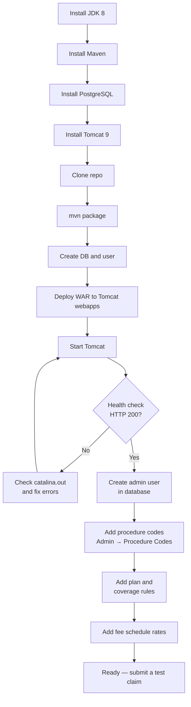

# Getting Started & Deployment

Everything needed to go from a clean machine to a running Meridian Claims instance — both the
**local developer setup** (build, database, deploy, first-run admin) and the **production
deployment** procedure (prod profile, env-var credentials, HTTPS, smoke test, rollback). No
prior knowledge of the codebase is assumed.

- New developer? Start at [Prerequisites](#prerequisites) and follow through to
  [First-Run Admin Setup](#first-run-admin-setup).
- Deploying to production? Jump to [Production Deployment](#production-deployment).

---

## Prerequisites

| Tool | Required version | Notes |
| ---- | --------------- | ----- |
| JDK | 8 (Zulu 8.0.492) | Must be Java 8 — the codebase targets Java 8 syntax and idioms |
| Maven | 3.9 or newer | Any recent 3.x release works |
| PostgreSQL | 14+ (tested on 18) | Must be running locally on port 5432 |
| Tomcat | 9.x | **Not Tomcat 10** — the app uses the `javax.servlet` namespace |
| Git | Any recent version | |

### Installing JDK 8 via SDKMAN

SDKMAN is the recommended way to manage the Java version on macOS/Linux.

```bash
# Install SDKMAN (skip if already installed)
curl -s "https://get.sdkman.io" | bash

# Reload your shell
source "$HOME/.sdkman/bin/sdkman-init.sh"

# Install and activate the exact JDK used by this project
sdk install java 8.0.492-zulu
sdk use java 8.0.492-zulu
```

Verify:

```bash
java -version
# Expected: openjdk version "1.8.0_492" or similar Zulu 8 output
```

To make this JDK the default for all future shells, run `sdk default java 8.0.492-zulu`.

### Activating JDK 8 in later sessions

If you open a new terminal and `java -version` shows a different JDK, re-activate with:

```bash
source "$HOME/.sdkman/bin/sdkman-init.sh" && sdk use java 8.0.492-zulu
```

### Installing Tomcat 9

On macOS with Homebrew:

```bash
brew install tomcat@9
```

Note the value of `$CATALINA_HOME` — typically `/opt/homebrew/Cellar/tomcat@9/<version>/libexec`
or `/usr/local/opt/tomcat@9/libexec`. Export it for the commands below:

```bash
export CATALINA_HOME=/opt/homebrew/opt/tomcat@9/libexec
```

On Linux, download Tomcat 9 from <https://tomcat.apache.org/download-90.cgi> and extract it.

---

## Clone and Build

```bash
git clone <repo-url> meridian-claims
cd meridian-claims

# Ensure JDK 8 is active before building
source "$HOME/.sdkman/bin/sdkman-init.sh" && sdk use java 8.0.492-zulu

mvn package
```

The build compiles the project, runs the JUnit 4 unit tests, and runs the DAO integration tests
against an H2 in-memory database. A clean build produces no test failures.

The output WAR is at:

```text
target/meridian-claims.war
```

### Running a single test

```bash
mvn test -pl . -Dtest=ClaimServiceTest
```

Replace `ClaimServiceTest` with any fully-qualified or simple class name. To run a single method:

```bash
mvn test -pl . -Dtest=ClaimServiceTest#testAdjudication
```

### Skipping tests (not recommended for first build)

```bash
mvn package -DskipTests
```

---

## Database Setup

### 1. Create the database and user

Connect to PostgreSQL as a superuser (e.g. `postgres`) and run:

```sql
CREATE USER meridian WITH PASSWORD 'meridian';
CREATE DATABASE meridian_claims OWNER meridian;
GRANT ALL PRIVILEGES ON DATABASE meridian_claims TO meridian;
```

From the command line:

```bash
psql -U postgres -c "CREATE USER meridian WITH PASSWORD 'meridian';"
psql -U postgres -c "CREATE DATABASE meridian_claims OWNER meridian;"
psql -U postgres -c "GRANT ALL PRIVILEGES ON DATABASE meridian_claims TO meridian;"
```

### 2. Schema migration

You do not run migrations manually. Flyway runs automatically on application startup and applies
all pending migrations from `src/main/resources/db/migration/`. The initial migration creates:

- `users` — application login accounts (username, bcrypt password hash, role, lockout fields)
- `audit_log` — system-wide audit trail (logins, config changes, job runs)

Later phases add the full domain schema (members, providers, plans, claims, payments, etc.).
Just deploy and start Tomcat — the schema will be current.

### 3. Connection defaults

The application uses these defaults out of the box:

| Setting | Value |
| ------- | ----- |
| Host | `localhost:5432` |
| Database | `meridian_claims` |
| Username | `meridian` |
| Password | `meridian` |
| Pool initial/max | 5 / 20 connections |

To override for your environment, create a properties file and pass it to Tomcat as a system
property, or use `-D` JVM args. See `docs/configuration.md` for details.

---

## Deploy and Run

### 1. Copy the WAR to Tomcat

```bash
cp target/meridian-claims.war "$CATALINA_HOME/webapps/"
```

Tomcat will auto-deploy it as the context `meridian-claims`.

### 2. Start Tomcat

```bash
"$CATALINA_HOME/bin/startup.sh"
```

On Windows: `%CATALINA_HOME%\bin\startup.bat`

Watch the log for the Flyway migration output and the Spring context startup:

```bash
tail -f "$CATALINA_HOME/logs/catalina.out"
```

You should see lines similar to:

```text
INFO  FlywayMigrationInitializer - Successfully applied 1 migration to schema "public"
INFO  DispatcherServlet - Completed initialization in ... ms
```

### 3. Stop Tomcat

```bash
"$CATALINA_HOME/bin/shutdown.sh"
```

### Port

The application listens on **port 8090**, not the Tomcat default of 8080. This is configured in
Tomcat's `conf/server.xml`. If you installed Tomcat via Homebrew, that configuration is already
in place. If you installed manually, add or update the HTTP connector:

```xml
<Connector port="8090" protocol="HTTP/1.1"
           connectionTimeout="20000"
           redirectPort="8443" />
```

---

## Smoke Test

Once Tomcat is up, verify the application is healthy:

```bash
curl -s -o /dev/null -w "%{http_code}" http://localhost:8090/meridian-claims/health
# Expected: 200
```

Or open a browser to:

```text
http://localhost:8090/meridian-claims/health
```

The health endpoint returns HTTP 200 and a short JSON body when the application is running and
the database connection pool is healthy.

Then open the login page:

```text
http://localhost:8090/meridian-claims/login
```

You should see the Meridian Claims login form. You will not be able to log in yet — see
First-Run Admin Setup below.

---

## First-Run Admin Setup

### Create the first admin user

The application ships with no seeded users. There is no default password. You must insert the
first ADMIN account directly into the database.

Choose a username and generate a bcrypt hash at cost 10. You can use any bcrypt tool — for
example, with Python:

```bash
python3 -c "import bcrypt; print(bcrypt.hashpw(b'YourPassword1!', bcrypt.gensalt(10)).decode())"
```

Or with htpasswd (Apache utils):

```bash
htpasswd -bnBC 10 "" 'YourPassword1!' | tr -d ':\n'
```

Then insert the user:

```sql
INSERT INTO users (
    username, password_hash, full_name, role,
    active, failed_login_count, password_changed_at
) VALUES (
    'admin',
    '$2a$10$<your-bcrypt-hash-here>',
    'System Administrator',
    'ADMIN',
    TRUE, 0, NOW()
);
```

Log in at `http://localhost:8090/meridian-claims/login` with the credentials you chose.

### Add procedure codes

The application ships with no CPT procedure codes. CPT codes are AMA-licensed — you may only
enter codes your organisation is licensed to use.

1. Log in as ADMIN.
2. Navigate to **Admin → Procedure Codes**.
3. For each code, enter the CPT code, description, and optionally a service type (e.g.
   `OFFICE_VISIT`, `LAB`, `RADIOLOGY`). Check Active.
4. Click **Save**.

Until at least one procedure code is entered, claim line items cannot be adjudicated and will
deny at the coverage rule check.

### Add plan coverage rules

The application ships with no insurance plans and no coverage rules. Without them every claim
denies at `CoverageRule`.

1. Navigate to **Admin → Plans** and create at least one plan. Set the benefit year start date,
   deductible, out-of-pocket maximum, copay amounts, timely filing days, and whether coordination
   of benefits applies.
2. For each plan, open **Coverage Rules** and add a rule per service type your plan covers
   (e.g. `OFFICE_VISIT`, `LAB`, `RADIOLOGY`). Each rule specifies the coinsurance percentage
   and any applicable limits.
3. Still on the plan, open **Fee Schedule** and add rates for each procedure code and service
   type combination your plan reimburses. Without a fee schedule rate, line items adjudicate but
   flag `NO_RATE` and approve at $0.

### Minimum viable setup checklist

Before submitting a test claim, confirm:

- [ ] At least one ADMIN user exists and can log in
- [ ] At least one Provider is registered (Admin → Providers)
- [ ] At least one Member is registered (Admin → Members) with a MemberCoverage record pointing
      to a plan
- [ ] Procedure codes for the services you intend to test are entered
- [ ] The member's plan has coverage rules for those service types
- [ ] The plan's fee schedule has rates for those procedure codes



---

## Production Deployment

Production runs the **same WAR** as local, under the `prod` profile. The differences from the
local procedure above:

| Step | Local (dev) | Production |
| ---- | ----------- | ---------- |
| Profile | `dev` (default) | `CLAIMS_PROFILE=prod` (or `-Dclaims.profile=prod`) |
| DB credentials | Literal values in `db.properties` | Env vars `MERIDIAN_DB_USER` / `MERIDIAN_DB_PASSWORD` |
| Property overlay | None needed | `$CATALINA_BASE/conf/meridian-claims-prod.properties` (template: [meridian-claims-prod.properties.sample](meridian-claims-prod.properties.sample)) |
| Flyway | Runs `migrate()` on startup | Runs `validate()` only — apply migrations manually before deploying |
| HTTPS | Not enforced | `HttpsEnforcementFilter` redirects HTTP→HTTPS; requires a TLS cert + HTTPS connector or proxy |
| Session cookie | Secure flag off (plain HTTP) | Secure flag on (`ProdSecureCookieListener`) |
| Mail / alerts | Disabled (`claims.mail.enabled=false`) | Enabled via overlay; `SMTPAppender` for ERROR alerts |
| First user | See [First-Run Admin Setup](#first-run-admin-setup) | Insert the initial ADMIN directly in the DB (below) |

> **`CATALINA_HOME` vs `CATALINA_BASE`:** `CATALINA_HOME` is the Tomcat install directory
> (`bin/`, `lib/`); `CATALINA_BASE` is the instance directory (`conf/`, `logs/`, `webapps/`). On a
> single-instance install they are the same. The property overlay goes in `$CATALINA_BASE/conf/`
> and the WAR in `$CATALINA_HOME/webapps/`; if they differ on your host, adjust accordingly.

### 1. Pre-deploy

- [ ] All Flyway migrations applied to the target database (`flyway validate` to confirm — `StartupValidator` also validates at boot and aborts if the schema is out of sync).
- [ ] Prod property overlay installed: copy `docs/meridian-claims-prod.properties.sample` to `$CATALINA_BASE/conf/meridian-claims-prod.properties` and fill in the production DB URL, pool sizing, and SMTP host/port. (This external file is not in the WAR; it overrides `application.properties`/`db.properties` at startup.)
- [ ] Environment variables set on the target host (the overlay references these — they are never written to the file):
  - `MERIDIAN_DB_USER` — database username
  - `MERIDIAN_DB_PASSWORD` — database password
  - `CLAIMS_PROFILE=prod` **or** JVM flag `-Dclaims.profile=prod`
- [ ] TLS certificate installed and Tomcat (or a front-end proxy) configured for HTTPS on port 443. The `HttpsEnforcementFilter` in the WAR handles the HTTP→HTTPS redirect for the app tier.

### 2. Deploy

```bash
mvn clean package -DskipTests    # build the WAR
cp target/meridian-claims.war "$CATALINA_HOME/webapps/"
```

Set the profile and credentials as **OS environment variables** before starting Tomcat
(preferred over `-D` JVM flags, which appear in `ps` output):

```bash
export CLAIMS_PROFILE=prod
export MERIDIAN_DB_USER=<db_username>
export MERIDIAN_DB_PASSWORD=<db_password>
"$CATALINA_HOME/bin/startup.sh"
```

### 3. First-user bootstrap (first production deploy only)

Flyway does **not** seed any users. After the first prod deploy, create the initial ADMIN
account directly in the database (generate the bcrypt-10 hash as shown in
[First-Run Admin Setup](#first-run-admin-setup)):

```sql
-- Run against the production database ONCE after the first deploy.
INSERT INTO users (username, full_name, email, password_hash, role, active,
                   failed_login_count, force_reset, created_at, updated_at)
VALUES ('<admin_username>', '<Full Name>', '<admin@yourdomain>', '<bcrypt_hash>',
        'ADMIN', true, 0, false, NOW(), NOW());
```

The ADMIN user can then log in and create further users via **Admin → User Management**. Complete
the procedure-code, plan, and fee-schedule steps from [First-Run Admin Setup](#first-run-admin-setup)
before processing real claims.

### 4. Post-deploy smoke test

- [ ] `curl -s -o /dev/null -w "%{http_code}\n" https://<host>/meridian-claims/health` → `200`
- [ ] Login works; session cookie arrives with `Secure; HttpOnly; SameSite=Strict`.
- [ ] HTTP request to the app redirects to HTTPS (301 + `Location: https://...`).
- [ ] `Strict-Transport-Security` header present on HTTPS responses.
- [ ] Security headers present on all responses: `X-Frame-Options: DENY`, `X-Content-Type-Options: nosniff`, `Content-Security-Policy` (with `default-src 'self'`), `Referrer-Policy: strict-origin-when-cross-origin`.
- [ ] `catalina.out` shows `Meridian Claims starting — profile: PROD`.
- [ ] `catalina.out` shows `Flyway schema validation passed (prod — auto-repair is disabled)`.
- [ ] Submit a test claim, approve it, run a report — confirm no errors.
- [ ] Trigger a 404 and a 500 (e.g. `/nonexistent`) — confirm a clean error page, no stack trace in the browser.

### 5. Rollback

- [ ] Stop Tomcat.
- [ ] Replace the WAR with the previous version.
- [ ] Restart Tomcat. (Flyway `validate` aborts startup if the schema is ahead of the rolled-back code — roll back the migration manually if required.)

### 6. Post-install operational setup (first deployment only)

- [ ] **Log rotation** — configure `logrotate` (or equivalent) to prune `$CATALINA_BASE/logs/meridian-claims.log.*` files older than 30 days. `DailyRollingFileAppender` rotates daily but does not auto-delete; without rotation, logs accumulate indefinitely.

  Example `/etc/logrotate.d/meridian-claims`:

  ```text
  /opt/tomcat/logs/meridian-claims.log.* {
      rotate 30
      daily
      missingok
      compress
      notifempty
  }
  ```

- [ ] **Load test** — before opening to full production traffic, run a load test (JMeter or equivalent): 500 concurrent users, 10k claims in the DB, target dashboard response < 3 s. Cannot run in CI; must be run against a production-scale database.
- [ ] **Two-session concurrency test** — verify deductible/OOP accumulator `SELECT FOR UPDATE` serialization with two simultaneous PostgreSQL sessions submitting claims for the same member. H2 single-threaded tests cannot prove this; it requires a real PostgreSQL instance.

> **Never** run `flyway repair` on a production database without explicit DBA approval. DB
> credentials must come from environment variables only (`StartupValidator` aborts startup if
> they are absent under the prod profile).

---

## IDE Tips

### IntelliJ IDEA

1. Open the project root as a Maven project (File → Open, select `pom.xml`).
2. Set the Project SDK to JDK 8: File → Project Structure → Project → SDK.
3. Mark `src/main/webapp` as a Web Resource Root if IntelliJ does not detect it automatically.
4. For running tests from the IDE, the JUnit 4 runner is used — confirm the run configuration
   uses JUnit (not JUnit 5 / JUnit Platform).

### Eclipse / Spring Tools Suite

1. Import as an Existing Maven Project.
2. Set the Java compiler compliance level to 1.8 (Project → Properties → Java Compiler).
3. Add a Tomcat 9 server runtime in the Servers view; do not add Tomcat 10.

### Common pitfalls

**Wrong Java version.**
Maven picks up whichever `java` is on `PATH`. If the build fails with syntax errors or class
version mismatch, check `java -version` and re-run `sdk use java 8.0.492-zulu`.

**Tomcat 10 instead of Tomcat 9.**
Tomcat 10 moved from `javax.servlet` to `jakarta.servlet`. The WAR will fail to deploy with
`ClassNotFoundException` for servlet classes. Use Tomcat 9 only.

**Port conflict on 8090.**
If something else is already on port 8090, either stop that process or change the Tomcat
connector port in `conf/server.xml` and update your health-check URL accordingly.

**Flyway checksum error on startup.**
Flyway migration files are append-only. Never edit a migration file that has already been
applied to your local database. If you see a checksum mismatch, drop and recreate the
`meridian_claims` database, then restart Tomcat to re-run migrations from scratch.

**`meridian_claims` database not found at startup.**
The DBCP2 pool is configured to fail fast (`testOnBorrow=true`). If the database does not
exist or the `meridian` user cannot connect, Tomcat will log a pool initialisation error and
the context will fail to start. Verify the database exists and the user credentials match
before starting Tomcat.

**Claims deny immediately after submission.**
The two most common causes on a fresh install are (a) no coverage rule for the service type on
the member's plan, or (b) no procedure code record for the CPT code on the claim line item.
Complete the First-Run Admin Setup steps above before testing claim adjudication.
