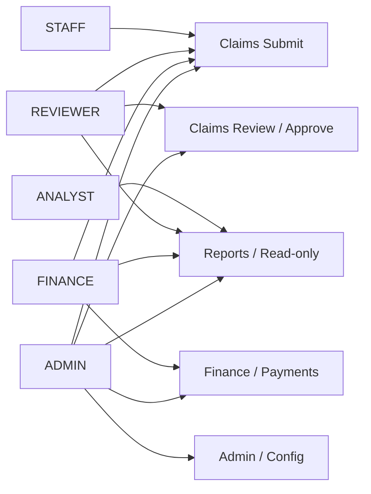
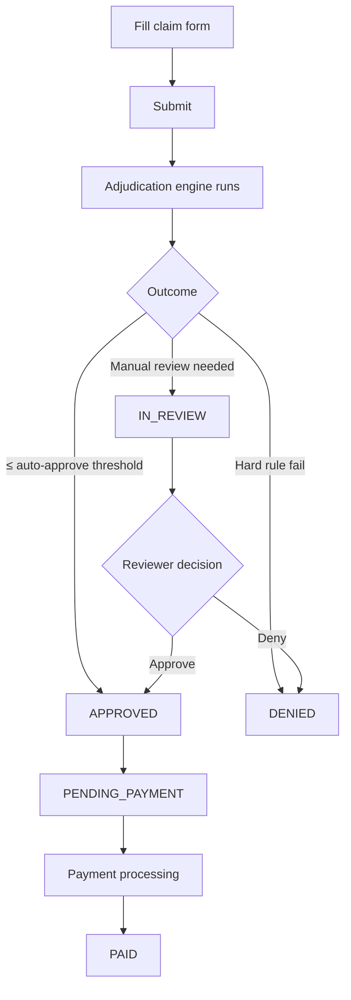
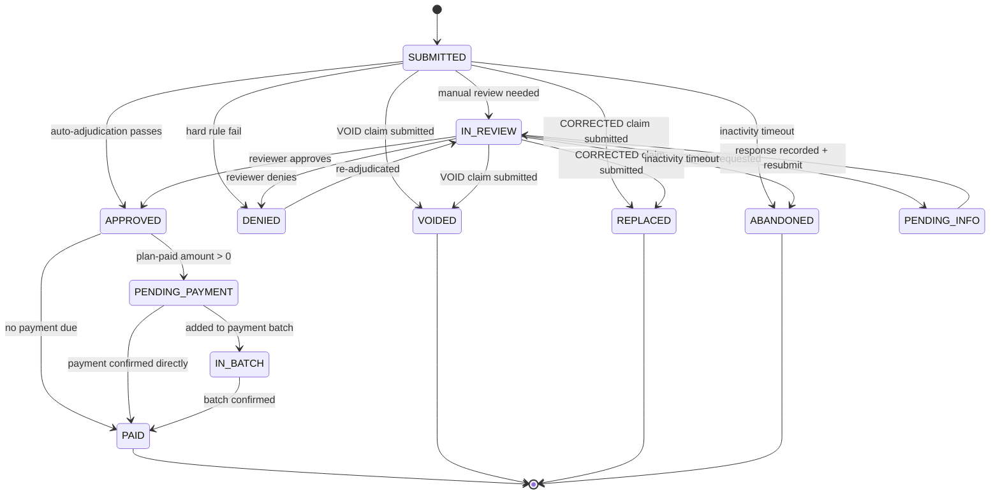

# Meridian Claims — User Guide

This guide covers every screen and task in Meridian Claims, organized by role. It is self-contained: no external links are needed.

---

## Contents

1. [Signing In and Out](#1-signing-in-and-out)
2. [Changing Your Password](#2-changing-your-password)
3. [The Dashboard](#3-the-dashboard)
4. [Reports (all roles)](#4-reports-all-roles)
5. [Role: STAFF](#5-role-staff)
6. [Role: REVIEWER](#6-role-reviewer)
7. [Role: FINANCE](#7-role-finance)
8. [Role: ADMIN](#8-role-admin)
9. [Role: ANALYST](#9-role-analyst)
10. [Claim Status Reference](#10-claim-status-reference)

---

---

## 1. Signing In and Out

### Sign in

1. Navigate to the Meridian Claims URL provided by your administrator.
2. Enter your **Username** and **Password** on the Sign In screen.
3. Click **Sign In**. If your credentials are correct you land on the Dashboard.

**Possible errors on the login screen:**

- "Invalid username or password" — check for typos; note that usernames are case-sensitive.
- "Account is locked" — contact your administrator to unlock your account (accounts lock after repeated failed attempts).
- "Your password must be reset" — you are redirected automatically to the Change Password screen.

### Sign out

Click your name or the **Sign Out** link in the navigation bar. You are returned to the Sign In screen with a "You have been signed out" message.

---

## 2. Changing Your Password

You can change your password at any time from the navigation bar. Administrators may also force a reset, which takes effect the next time you sign in.

### Steps

1. Click **Change Password** in the navigation bar (or complete the forced-reset flow if prompted).
2. Enter your **Current Password**.
3. Enter your **New Password**. Requirements: at least 8 characters, at least one number, at least one special character.
4. Repeat the new password in **Confirm New Password**.
5. Click **Change Password**.

On success you are returned to the Dashboard and a green confirmation banner appears.

---

## 3. The Dashboard

The Dashboard is the first page you see after signing in. It gives a live summary of activity relevant to your role.

### Stat tiles

| Tile | Who sees it | Meaning |
| --- | --- | --- |
| Submitted Today | All roles | Number of claims submitted today |
| This Week | All roles | Number of claims submitted in the current calendar week |
| My Queue (IN_REVIEW) | REVIEWER, ADMIN | Claims currently assigned to you in IN_REVIEW status |
| SLA Breaches | REVIEWER, ADMIN | Claims that have exceeded the SLA threshold for their current status; shown in red when greater than zero |
| Paid This Month | FINANCE, ADMIN | Total plan-paid amount for the current month, with last month shown below for comparison |

### Claims by Status

A grid of tiles showing the count of claims in every active status. Useful for spotting a buildup in any particular status.

### Top Denial Reasons (last 30 days)

A table showing the most common denial reason codes, their descriptions, and the count of claims denied with each code over the past 30 days. Useful for identifying systemic issues.

### Recent Activity

A feed of the most recent claim status transitions system-wide: claim number (linked), event type, old status, new status, and timestamp.

### Quick Actions

Shortcut cards to the most common tasks for your role: Submit a Claim, Review Queue, Reports, Appeals, Members, Providers, and (for ADMIN) User Management.

---

## 4. Reports (all roles)

All roles except STAFF have read access to Reports. ANALYST access is reports and dashboard only. Navigate to **Reports** in the navigation bar or click the Reports quick-action card on the Dashboard.

Every report page offers:

- **Date range filter** (From / To) where applicable.
- **Filter button** to apply the selected range.
- **CSV export** button to download the current result set as a spreadsheet.
- **Print button** to open the browser print dialog (navigation and buttons are hidden in print view).

Reports are grouped into four categories.

---

### Claims reports

#### Claims Summary

Shows claim counts and dollar totals grouped by status for the selected date range. Columns: Status, Claim Count, Total Billed, Total Plan Paid. Use this to get a quick financial snapshot across statuses.

#### Claims Detail

A paginated, line-level list of every claim in the selected date range, filterable by date range and status. Columns: Claim #, Type, Member, Provider, DOS, Status, Denial Code. Each claim number links directly to the claim detail screen. Export to CSV for bulk analysis.

#### Denial Report

Denials broken down by year, month, reason code, CARC code, and description for the selected date range. Columns: Year, Month, Reason Code, CARC, Description, Count. Use this to identify denial trends and monitor whether a rule change reduces denials over time.

#### Adjudication Rule Report

Shows how often each adjudication rule fired within the date range, how many times it passed or failed, and the denial percentage it contributed. Columns: Rule, Type, Evaluations, Passed, Failed, Deny %. Use this to assess the impact of individual rules and spot rules that are denying at an unexpectedly high rate.

#### COB Report

Lists all secondary-coverage claims within the date range. Columns: Claim #, DOS, Coverage Order, Primary Paid, Secondary Paid, Member Responsibility, Total Allowed. Use this to verify that coordination-of-benefits calculations are accurate and to identify members where primary and secondary liability totals add up correctly.

#### Fee Schedule Coverage Report

Lists every procedure code that was billed with no fee schedule rate on file (marked NO_RATE), along with the count of NO_RATE line items and the most recent date of service. This report has no date-range filter; it reflects all time. Use this to identify gaps in the fee schedule that an administrator needs to resolve in Admin > Plans > Fee Schedule.

---

### Financial reports

#### Payment Report

A date-ranged list of payments. Columns: Payment ID, Claim #, Provider, NPI, Plan Paid, Status, Payment Date, Batch ID. Use this to reconcile payments against external remittance records or to look up a specific batch's constituent payments.

#### Subrogation Report

A full list of subrogation cases regardless of status. Columns: Case ID, Claim #, DOS, Date Opened, Status, Liable Party, Recovery Amount, Plan Paid. Use this to monitor how much the plan has paid on accident-related claims and how much has been or is expected to be recovered from third parties.

---

### Workflow reports

#### Appeals Report

Summarizes appeals by type, status, and outcome for the date range. Columns: Appeal Type, Status, Outcome, Count, Average Days to Resolve. Use this to track appeal volume, approval/denial rates, and whether the team is resolving appeals within acceptable timeframes.

#### SLA Performance Report

Shows how many claims in each status breached the SLA threshold, the breach percentage, and the reviewer the claims were assigned to. Columns: Status, Claim Count, Breach Count, Breach %, Reviewer. Use this to identify which reviewers or statuses are consistently over the SLA target.

---

### Activity reports

#### Member Activity Report

Enter a Member ID and click **Load** to see every claim, payment, appeal, and EOB document associated with that member, in a single unified timeline. Columns: Type (claim/payment/appeal/EOB), ID, Reference, Date, Status or Outcome, Notes. Export to CSV for member-level auditing or to prepare a response to a member inquiry.

#### Provider Activity Report

Enter a Provider ID and click **Load** to see every claim submitted by that provider, with payment and remittance information. Columns: Claim #, DOS, Status, Billed, Plan Paid, Payment Date, Remit Batch. Use this to produce a provider-level payment history or to investigate a billing pattern.

---

## 5. Role: STAFF

STAFF users submit claims, manage members and providers, create prior authorizations and referrals, and respond to information requests. STAFF cannot approve, deny, or adjudicate claims, and cannot access Finance or Admin screens.

### 5.1 Submitting a claim

#### Before you start

Check that the member and provider records already exist. If procedure codes or diagnosis codes are missing, the form shows an error and no claim can be submitted until an administrator adds them in Admin > Lookup Tables.

#### Submission steps

1. Click **+ New Claim** on the Claims list page, or click **Submit a Claim** on the Dashboard.
2. Fill in the **Claim Header** section:
   - **Claim Type**: select ORIGINAL, CORRECTED, or VOID. For CORRECTED or VOID you must also supply the **Original Claim ID** of the claim being corrected or voided.
   - **Member**: select the insured member from the dropdown (shows member number and full name).
   - **Provider**: select the billing provider from the dropdown (shows name and NPI).
   - **Date of Service**: the date the service was rendered.
   - **Coverage Order**: PRIMARY for the member's primary plan, SECONDARY if this is a secondary (COB) claim. Selecting SECONDARY reveals the **Primary Paid Amount (COB)** field — enter the dollar amount the primary insurer has already paid.
   - **Prior Auth Number**: enter if a prior authorization was obtained.
   - **Referral Number**: enter if a referral is on file.
   - **Accident-related**: check this box if the service is related to an accident. An Accident Type (Auto, Work, Other) and Accident Date field appear.
   - **Notes**: optional free text.

3. Add **Diagnoses** (1 PRIMARY required; up to 12 total):
   - The first row defaults to PRIMARY. Add additional SECONDARY rows with **+ Add Diagnosis**.
   - Use the search box above each code picker to filter the list by typing a code or keyword; the picker auto-selects the code when only one match remains.
   - Remove a row with the **x** button (at least one diagnosis must remain).

4. Add **Line Items** (at least one required):
   - Select a **Procedure Code** from the picker (search by typing).
   - Enter the **Billed Amount** in dollars (e.g., `125.00`).
   - Add additional lines with **+ Add Line Item**. Remove a line with **x**.

5. Click **Submit Claim**. The system assigns a claim number, runs automatic adjudication, and redirects you to the claim detail screen showing the resulting status.

#### Validation notes

- At least one diagnosis of type PRIMARY is required.
- At least one line item is required.
- Billed amounts must be numeric with up to two decimal places.
- The coverage order field determines which plan is used for adjudication. If a member has no active coverage for the selected plan or the date of service falls outside coverage dates, adjudication may deny the claim automatically.

---

### 5.2 Viewing and searching claims

Navigate to **Claims** in the navigation bar.

- **Search box**: type a full or partial claim number or member name.
- **Status filter**: narrow to a specific status.
- Use the **Search** button to apply filters; **Clear** to reset.
- Click a **Claim #** or the **View** link to open the claim detail screen.

STAFF users see all claims they have access to. They do not see the Assignee filter or the SLA Breached filter (those are for REVIEWERs and ADMINs).

---

### 5.3 Responding to information requests

When a reviewer requests additional information on a claim, the claim moves to PENDING_INFO status and an Info Request record appears on the claim detail screen.

1. Open the claim from the Claims list.
2. Scroll to the **Info Requests** section.
3. Find the open request (status OPEN, showing who the request is from, the due date, and the request details).
4. Type your response in the **Response notes** field.
5. Click **Record Response**. The request status changes to CLOSED and the claim can be moved back to IN_REVIEW by a reviewer.

---

### 5.4 Adding notes to a claim

Any user can add a note to any claim they can view.

1. Open the claim detail screen.
2. Scroll to the **Notes** section.
3. Type in the text field and click **Add Note**.

Notes are timestamped and attributed to your user account. They are permanent and cannot be deleted.

---

### 5.5 Managing members

Navigate to **Members** in the navigation bar.

#### Viewing a member

Click the member's name or number to open the member detail screen. This shows personal information, all coverage records, and controls to add a new coverage record or remove an existing one.

#### Creating a member

Click **+ New Member** on the Members list. Fill in full name, date of birth, address, phone, and email. The system assigns a member number.

#### Editing a member

Open the member detail screen and click **Edit** to update personal information.

#### Managing coverage

On the member detail screen, the **Add Coverage** section lets you attach a plan to the member:

- Select the **Plan**, set the **Coverage Order** (PRIMARY or SECONDARY), enter the **Effective Date**, and optionally a **Termination Date**.
- Click **Add Coverage**.

To remove a coverage record, click **Remove** on the relevant row and confirm. Removing coverage does not delete historical claims tied to that coverage.

#### Prior authorizations and referrals

On a member detail screen, click **+ Prior Auth** or **+ Referral** to create the corresponding record pre-filled with the member's ID. You can also navigate to **Prior Auth** or **Referrals** in the navigation bar and create records from there.

---

### 5.6 Managing providers

Navigate to **Providers** in the navigation bar. The workflow mirrors members: list view with search, a detail view showing NPI and network status, and edit controls. Creating a provider requires name, NPI, and network status.

---

## 6. Role: REVIEWER

REVIEWER users work the claims review queue, make approve/deny/request-info decisions, manage assignments, trigger re-adjudication, and manage appeals. REVIEWERs have full read access to claims and member/provider data, but cannot access Finance or Admin screens.

### 6.1 Working the claims queue

Navigate to **Claims** in the navigation bar.

#### Filters available to REVIEWER

In addition to the basic search and status filters, REVIEWERs see:

- **Assignee**: filter to claims assigned to a specific reviewer (select "Mine" to see your own queue).
- **Unassigned** checkbox: show only claims with no reviewer assigned.
- **SLA Breached** checkbox: show only claims that have exceeded the SLA threshold for their current status. Rows that are SLA-breached are highlighted in yellow in the table.

A typical review session:

1. Check the **SLA Breached** filter first to address the highest-priority items.
2. Filter by status IN_REVIEW and assignee "Mine" to work your personal queue.
3. Filter by status IN_REVIEW and check **Unassigned** to pick up unassigned claims.

---

### 6.2 Assigning claims

On the claim detail screen, the **Assignment** section shows the current assignee (or "unassigned"). To assign or reassign:

1. Enter the reviewer's user ID in the **Reviewer user ID** field (leave blank to unassign).
2. Click **Assign**.

Only REVIEWERs and ADMINs can assign claims.

---

### 6.3 Approving a claim

The **Reviewer Actions** section appears on any claim in SUBMITTED or IN_REVIEW status.

1. In the **Approve** form, type approval notes in the notes field (required).
2. Click **Approve** and confirm the prompt.

The claim moves to APPROVED status (and then automatically to PENDING_PAYMENT if the plan-paid total is greater than zero, or PAID if no payment is due).

---

### 6.4 Denying a claim

1. In the **Deny** form, enter a **Reason code** (required) — this must be a valid denial reason code configured in the system.
2. Enter **Denial notes** (required).
3. Click **Deny** (shown in red) and confirm the prompt.

The claim moves to DENIED status.

---

### 6.5 Requesting additional information

When a claim requires documentation from the member or provider before a decision can be made:

1. In the **Request Info** form, select who the request is directed to: Member, Provider, or Both.
2. Set a **Due Date** for the response.
3. Enter **Request details** describing exactly what information is needed.
4. Click **Request Info**.

The claim moves to PENDING_INFO status. A notification is sent to the appropriate party. When a response is recorded, a REVIEWER or ADMIN uses the **Resubmit** button (see below) to move the claim back to IN_REVIEW for a decision.

---

### 6.6 Resubmitting after information is received

Once STAFF has recorded a response to an info request:

1. Open the claim (status will be PENDING_INFO).
2. Review the response in the Info Requests section.
3. Click **Resubmit** in the header action area and confirm.

The claim returns to IN_REVIEW. The Reviewer Actions panel reappears so you can approve, deny, or request further information.

---

### 6.7 Re-adjudicating a claim

Re-adjudication re-runs the full adjudication pipeline against the claim's current data and plan rules. This is appropriate after a plan rule change that should affect a previously denied or in-review claim.

The **Re-adjudicate** button appears on claims in DENIED or IN_REVIEW status for REVIEWERs and ADMINs.

1. Click **Re-adjudicate** on the claim detail screen.
2. Confirm the prompt.

The adjudication pipeline runs immediately. The Adjudication Results section of the claim updates with a new run, and the claim status may change based on the outcome.

---

### 6.8 Working the appeals queue

Navigate to **Appeals** in the navigation bar.

The appeals list shows all appeals with their status (OPEN, APPROVED, DENIED, WITHDRAWN), type, submitted date, and deadline.

Click an appeal to open the Appeal detail screen.

#### Appeal detail screen

Shows:

- The linked claim ID (click to open the claim).
- Appeal type and submitted/deadline dates.
- Outcome notes (if the appeal has been resolved).

If the appeal is OPEN, three action buttons appear:

##### Approve appeal

1. Enter outcome notes (required) describing why the appeal is approved.
2. Click **Approve** and confirm.

Approving an appeal triggers automatic re-adjudication of the linked claim. If the claim was DENIED, it will be re-processed and the status updated based on the new adjudication result.

##### Deny appeal

1. Enter a denial reason in the outcome notes field (required).
2. Click **Deny** (shown in red) and confirm.

The appeal moves to DENIED status. The linked claim's status is unaffected.

##### Withdraw appeal

Click **Withdraw** and confirm. Use this when the requester has formally withdrawn their appeal. The appeal moves to WITHDRAWN status.

---

## 7. Role: FINANCE

FINANCE users process payments, manage remittance batches, work EOB documents, and manage subrogation cases. FINANCE users can view claims (read only, no approve/deny) and read reports, but cannot access Admin screens or perform reviewer actions.

### 7.1 Payment Queue

Navigate to **Finance > Payments** in the navigation bar.

The Payment Queue lists every payment record in PENDING status. A payment record is created automatically when a claim reaches APPROVED status with a non-zero plan-paid total.

**Columns:** Payment ID, Claim ID (linked), Plan Paid Total, Member Responsibility, Status.

To record a payment for an individual claim:

1. Click **Record Payment** on the relevant row.
2. You are taken to the Payment Detail screen, where you can confirm the amounts and mark the payment as processed.

After recording a payment, the corresponding claim moves from APPROVED / PENDING_PAYMENT to IN_BATCH or PAID depending on whether it has been added to a remittance batch.

---

### 7.2 Payment Batches

Navigate to **Finance > Payment Batches** in the navigation bar.

Payment batches group multiple pending payments into a single exportable file for transmission to the bank or payment processor.

#### Creating a new batch

1. In the **Create New Batch** section, enter the **Batch Date** (the payment processing date).
2. Click **Create Batch** and confirm. The system gathers all current PENDING payments and groups them into a new batch.

The count of currently pending payments is shown above the button so you can confirm the expected size of the batch before creating it.

#### Batch list

All batches are listed below with their batch number, date, total dollar amount, status (PENDING or EXPORTED), and a file reference once exported. Click **View** to open a batch detail screen showing the individual payments in the batch and controls to export the batch file.

---

### 7.3 Remittance Batches

Navigate to **Finance > Remittance** in the navigation bar.

Remittance batches are outbound payment advices sent to providers. They differ from payment batches: a payment batch records that the plan is paying; a remittance batch is the electronic or paper notice sent to the provider explaining the payment.

#### Pending Payments

The top of the screen lists payments that are eligible to be included in a remittance batch, showing Payment ID, Claim ID, Plan Paid amount, and status.

#### Generating a new remittance batch

1. Enter the **Payment IDs** (comma-separated) you want to include in this batch.
2. Enter the **Payment Date** (the date to show on the remittance advice).
3. Click **Generate Batch**.

#### Batch history

All previously generated batches are listed with batch number, payment date, total paid, status (PENDING or SENT), and generation timestamp. Click **View** to open a batch detail screen with the following actions:

- **Mark Sent** — records that the remittance advice has been transmitted to the provider.
- **Download 835** — downloads the batch as an X12 EDI 835 remittance advice file
  (`remittance-{id}.835`). Use this to send machine-readable remittance data to providers
  or clearinghouses that accept electronic 835 files.

---

### 7.4 Explanation of Benefits (EOB) Documents

Navigate to **Finance > EOB** in the navigation bar.

EOB documents are generated automatically when a claim is adjudicated. They are sent to members to explain how their claim was processed.

To look up EOBs for a specific member:

1. Enter the **Member ID** in the search field.
2. Click **Search**.

The table lists every EOB for that member, showing: EOB ID, Claim ID (linked), Member ID, generation timestamp, and delivery method (PENDING or a completed delivery channel). Click **View** to open the full EOB document.

---

### 7.5 Subrogation Cases

Navigate to **Finance > Subrogation** in the navigation bar.

Subrogation cases are created when a claim is flagged as accident-related and the plan has the right to recover the payment from a liable third party (an at-fault driver's insurer, a workers' compensation carrier, etc.).

The Subrogation list shows all open cases with their case ID, linked claim, date opened, status, liable party, and any recovery amount recorded so far.

Click **Manage** on a case to open the Subrogation Detail screen, where you can:

- Record the liable party.
- Record recovery amounts as they are received.
- Update the case status (OPEN, IN_RECOVERY, CLOSED).
- Add notes.

---

## 8. Role: ADMIN

ADMIN users have full access to everything in the system: all STAFF, REVIEWER, and FINANCE capabilities, plus user management, plan administration, lookup table maintenance, fee schedule management, the operations console, and the audit log.

### 8.1 User Management

Navigate to **Admin > Users** in the navigation bar.

#### User list

Shows all users with username, full name, role, status, and last login time. Status values:

- **Active**: the account is fully functional.
- **Inactive**: the account has been deactivated and cannot log in.
- **Locked**: the account has been locked (typically after repeated failed logins).
- **Reset Required**: the user must change their password on next login.

#### Creating a user

Click **New User**. Fill in username, full name, role, and an initial password. The user will be prompted to change the password on first login.

#### Editing a user

Click **Edit** on any user row to update their full name, role, or email address. You cannot change a username after creation.

#### Deactivating and activating

- Click **Deactivate** to disable an account. The user cannot log in while deactivated.
- Click **Activate** to re-enable the account.

#### Unlocking

If an account is locked (status shows "Locked"), click **Unlock** to clear the lockout and allow the user to sign in again.

#### Forcing a password reset

Click **Force Reset** to flag the account so the user must set a new password on their next login. The user remains able to sign in; they are just redirected to the Change Password screen before reaching any other page.

#### Role reference

| Role | What they can access |
| --- | --- |
| ADMIN | All screens, including user management, admin tools, and all claim operations |
| REVIEWER | Claim review queue; approve / deny / pending-info; SLA tracking |
| STAFF | Claim submission; member / provider lookup; info requests; own claims |
| FINANCE | Payment processing; payment batch export; remittance advice; EOB mailing |
| ANALYST | Reports and dashboard (read-only) |

---

### 8.2 Plan Administration

Navigate to **Admin > Plans** in the navigation bar.

#### Plan list

Shows all insurance plans with plan name, type, deductible, out-of-pocket maximum, copay, in-network coverage percentage, and timely filing limit (days).

#### Creating a plan

Click **+ New Plan**. Required fields include plan name, plan type, deductible amount, OOP maximum, copay, in-network coverage percentage, out-of-network coverage percentage, benefit year start month, and timely filing days.

#### Editing a plan

Click **Edit** on any plan row to update its parameters. Changes take effect for newly adjudicated claims. To apply changes retroactively to existing claims, use Bulk Re-adjudication in Operations.

#### Deactivating a plan

Click **Deactivate** and confirm. Deactivated plans cannot be selected for new claims but remain on record for historical claims.

#### Managing the fee schedule

Click **Fee Schedule** on any plan row. The fee schedule maps procedure codes to allowed amounts for that plan. Add a rate by entering a procedure code and allowed amount, then click **Add**. Edit or delete existing rates from the same screen. Procedure codes billed without a matching fee schedule entry will receive NO_RATE and the claim line item will have no allowed amount, which typically results in denial.

---

### 8.3 Lookup Tables

Navigate to **Admin > Lookups** in the navigation bar. Lookup tables define the master lists of codes used throughout the system.

#### Procedure Codes

A procedure code must exist here before it can be selected on a claim form. Each code has a code value, description, and optional service type. Add, edit, or deactivate codes from this screen.

#### Diagnosis Codes

A diagnosis code must exist here before it can be selected on a claim form. Each code has a code value and description.

#### Denial Reasons

Denial reason codes appear in the Deny form on the claim detail screen. Each code has a reason code, CARC (Claims Adjustment Reason Code), and description. Reviewers must select from this list when denying claims.

#### Service Types

Service types categorize procedure codes (e.g., OFFICE_VISIT, INPATIENT, EMERGENCY). They drive plan-level coverage rules.

---

### 8.4 Operations Console

Navigate to **Admin > Operations** in the navigation bar.

#### Bulk Re-adjudication

Re-runs the full adjudication pipeline on all claims in a selected status. Use this after changing a plan rule that should retroactively affect claims that were previously denied or are currently in review.

1. Select the target status from the dropdown: **DENIED** or **IN_REVIEW**.
2. Click **Run Bulk Re-adjudication** and confirm. The system processes all qualifying claims asynchronously. This may take several minutes if the claim volume is large.

Do not close your browser or navigate away immediately; refresh the Recent Scheduled Job Runs table to monitor progress.

#### Manually Trigger a Scheduled Job

The system has several background jobs (for example: claim abandonment, SLA monitoring, EOB generation). Normally they run on their configured schedule. This panel lets you run any triggerable job immediately.

1. Select the job from the **Job** dropdown.
2. Click **Run Now** and confirm.

The job executes immediately. Its progress and outcome appear in the **Recent Scheduled Job Runs** table below.

#### Recent Scheduled Job Runs

A log of recent job executions with job name, start time, completion time, status (SUCCESS, RUNNING, or FAILED), records processed count, and any error message. Use this to verify that scheduled jobs are running successfully and to diagnose failures.

#### Archived Claims

Click **Search Archived Claims** to open the archive search screen, which lets you look up claims that have been moved out of the live claims table after reaching a terminal status and aging out.

---

### 8.5 Intake Batches

Navigate to **Admin > Intake Batches** in the navigation bar.

This screen shows the history of all batch claim files processed by the inbound file poller
(FHIR R4 JSON and X12 EDI 837 files dropped into the configured inbound directory).

Each row shows:

| Column | Description |
| --- | --- |
| **#** | Batch ledger ID |
| **File Name** | Original filename as it appeared in the inbound directory |
| **Status** | **COMPLETED** (all records accepted), **PARTIAL** (some quarantined), or **FAILED** (no records accepted) |
| **Total** | Number of claim records in the file |
| **Succeeded** | Records successfully submitted through adjudication |
| **Quarantined** | Records that failed validation and were not submitted |
| **Processed At** | Timestamp the poller finished processing the file |
| **Notes** | Quarantine reasons for failed records |

Claims submitted via batch intake appear in the normal claims worklist alongside manually
entered claims. Quarantined records appear only in this table with their error description.

To process files manually without waiting for the 5-minute poll interval, go to
**Admin → Operations** and trigger the `inboundClaimFilePollerJobDetail` job.

---

### 8.6 Audit Log

Navigate to **Admin > Audit Log** in the navigation bar.

The audit log records every significant action in the system: who did what, to which record, and when.

#### Filtering

Use any combination of the following filters:

- **Username**: show actions by a specific user.
- **Event type**: show a specific type of action (e.g., CREATE, UPDATE, DELETE, LOGIN).
- **Entity type**: show actions on a specific type of record (e.g., MEMBER, CLAIM, USER, PLAN).
- **From / To**: limit to a date range.

Click **Search** to apply filters. Click **Clear** to reset all filters and show the full log.

#### Columns

Date/Time, User, Event, Entity, Entity ID, Description.

Results are paginated; use the Previous / Next links to navigate.

---

## 9. Role: ANALYST

ANALYST users have read-only access to the Dashboard and all Reports. They can view member, provider, claim, and referral data (GET only — no creating, editing, or deleting). They cannot access Finance or Admin screens.

### What ANALYST users can do

- View the Dashboard (all stat tiles, Claims by Status, Top Denial Reasons, Recent Activity).
- Access all 12 reports in the Reports section, apply filters, and export to CSV or print.
- View member records, provider records, claim detail screens, prior auth records, and referral records.
- Add notes to claims (notes are a safe, non-mutating annotation).

### What ANALYST users cannot do

- Submit, edit, or void claims.
- Approve, deny, request info, or re-adjudicate claims.
- Create or edit members, providers, prior auths, or referrals.
- Access Finance screens (Payments, Batches, Remittance, EOB, Subrogation).
- Access Admin screens (Users, Plans, Lookups, Operations, Audit Log).

### Typical workflows

**Producing a monthly summary:** Go to Reports > Claims Summary, set the date range to the first and last day of the month, click Filter, then click CSV to download.

**Investigating denial trends:** Go to Reports > Denial Report, set the date range, and look for reason codes with a high count or an upward trend month over month.

**Reviewing an individual member's history:** Go to Reports > Member Activity, enter the member's ID, and click Load.

**Monitoring SLA compliance:** Go to Reports > SLA Performance, set a date range, and review the Breach % by reviewer and status.

---

## 10. Claim Status Reference

A claim moves through the following statuses during its lifecycle. The system enforces that only legal transitions are allowed; any attempt to move a claim outside these paths is rejected.

| Status | Meaning |
| --- | --- |
| SUBMITTED | Claim has been submitted and is awaiting initial adjudication. |
| IN_REVIEW | Claim is being reviewed by a reviewer (either automatically routed or manually assigned). |
| PENDING_INFO | A reviewer has requested additional information; waiting for member or provider response. |
| APPROVED | Claim adjudication is complete and the claim has been approved. |
| DENIED | Claim has been denied. A denial reason code and notes are required. |
| PENDING_PAYMENT | Claim is approved and a payment record exists but has not yet been processed. |
| IN_BATCH | Payment has been grouped into a payment batch but not yet confirmed as paid. |
| PAID | Payment has been confirmed. Terminal status. |
| VOIDED | A subsequent VOID claim has replaced this claim. Terminal status. |
| REPLACED | The claim has been corrected and a replacement claim has been submitted. Terminal status. |
| ABANDONED | The claim was not acted on within the required period and was closed by the system. Terminal status. |

### SLA breach warnings

Claims highlighted in yellow on the Claims list, and the orange SLA breach banner on a claim detail screen, indicate that the claim has been in its current status longer than the configured SLA threshold. These claims should be prioritized by reviewers.

---

Last updated: 2026-06-30
